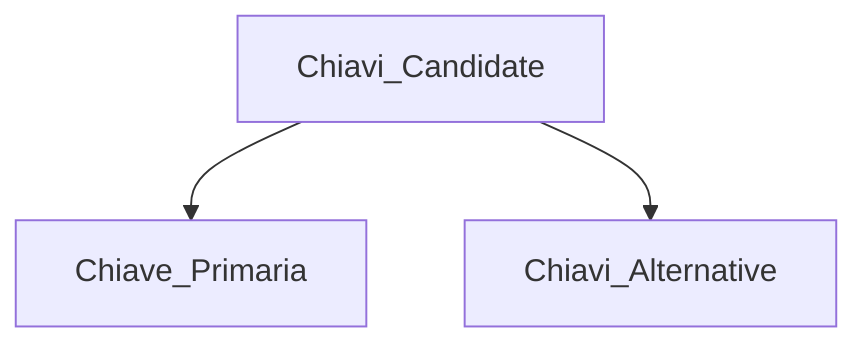

# Basi di dati

## Obbiettivo del corso

Imparare i concetti base relativi ai sistmi di gestione dei dati, ovvero:

- Come progettarli
- Come crearli
- Come ottimizzarli
- Come utilizzarli.

> Modello dei dati
> **Relazionali** -> usano la struttura dati della relazione come modo di organizzare

## Aspetti Introduttivi

**BASI DI DATI**

> Collezione di dati tra loro correlati, utilizzati per rappresentare le informazioni di interesse in un sistema informativo.

**SISTEMA DI GESTIONE DI BASI DI DATI (BDSM)**

> Sistema di software che fornisce gli strumenti necessari per gestire i dati.

**SISTEMA INFORMATIVO**

> Gestisce e rende disponibili attraverso strumenti, le informazioni di interesse supportato da un calcolatore.

_Componenti_:

- Strumenti per la rappresentazione delle **_informazioni_**, mediante una qualche codifica.
- **_Programmi Applicativi_** e di sistema che realizzano tutte le funzioni necessarie alla gestione delle informazioni.

Informazioni -> Sotto forma di **DATI**.

> Hanni bisogno di un contesto interpretativo che permette di estrarre da essi le info di interesse per gli utenti (es. Matricola, Numero_telefono, ecc...)

## DBMS (DATA BASE MANAGEMENT SYSTEM)

Sistema software in grado di gestire collezioni di dati che siano:

- Grandi
- Condivisi
- Persistenti

  > Cioè tempo di vita non limitato a quello dell'esecuzione dei programmi che li utilizzano.

  Assicurando la loro affidabilità e sicurezza.

**_STRUMENTO VINCENTE_** -> **_SCHEMA LOGICO_** -> Descrive la struttura dei dati.

**_CARATTERISTICHE_**

- Dimensioni maggiori della memoria centrale disponibile;
- Condivisione dei dati tra applicazioni ed utenti, **risorsa integrata**, condivisa da più settori aziendali -> Gestisce la concorrenza:
  - Riduzione della ridondanza dei dati;
  - Riduzione delle inconsistenze tra dati;
  - Meccanismo di controllo dell'accesso concorrente.
- Sicuri -> Con meccanismo di cloud, backup;
- Efficienza -> sia in tempo che in spazio, capacità di svolgere le operazioni utilizzando risorse accettabili dall'utente;
- Efficacia -> Capacità di rendere produttive le attività degli utenti.

Estende le funzionalità del file system fornendo più servizi ed in maniera **integrata**.

**Necessità di usare**:

- Insieme di strutture dati;
- Linguaggi per:
  - specificare dati;
  - aggiornare strutture;
  - specificare vincoli su strutture;
  - manipolare/cercare dati.

**Istanza** -> Insieme di dati presenti in un determinato momento in una struttura dati.  
**Tuple** -> righe quando si parla di **relazioni**.

La rappresentazione dei dati in un **DBSM** opera su due livelli:

- Fisico
- Logico

### INDIPENDENZA DEI DATI

- **Indipendenza Fisica** -> l'amministrazione del database può modificare lo schema fisico del database senza alterare lo schema logico e le viste
- **Indipendeza Logica** -> la presenza delle visite permette di nascondere modifiche alla rappresentazione dei dati al livello logico delle applicazioni/utenti che vedono la rappresentazione esterna (tramite vista)
  - Esempio: Cambia lo schema logico (aggiunta di un attributo), solo una parte delle viste cambia

### LINGUAGGI DI UN DBMS

#### DATA DEFINITION (DDL)

- Permette di specificare e modificare lo **schema** della base di dati, lo schema delle viste;
- Livello logico ed esterno.

#### DATA MANIPULATION LANGUAGE (DML)

- Permette di creare, modificare ed interrogare attraverso query **l'istanza** della base di dati;
- Livello logico ed esterno.

#### STORAGE DEFINITION LANGUAGE (SDL)

- Definisce lo schema fisico del DB;
- Livello Fisico.

**Il linguaggio SQL ha comandi di entrambi i linguaggi (DDL/DML).**

## IL MODELLO RELAZIONALE

- Proposto nel 1970 per favorire l'indipendenza dei dati, reso disponbile come modello logico in DBMS nel 1981;
- Modello logico più diffuso ed adottato per livelli commerciali.

### CARATTERISTICHE

- Basato su una semplice struttura di dati -> **LA RELAZIONE**:
  - **DEF**: Sottoinsieme finito del prodotto cartesiano;
  - si associa un nome a ogni componente delle colonne (**TUPLE**) -> **nome di attributo**;
  - ogni relazione è rappresentata in maniera informale sotto forma di **tabella**.
- É caratterizzato da precise basi matematiche;
- Semplice rappresenzione di dati con linguaggi dichiarativi:
  - anche per utenti poco esperti;
  - possibilità di attuare strategie di ottimizzazione.
- Facilità con cui possono essere espresse interrogazioni;
- É possibile rappresentare l'assenza del valore per un attributo poichè non tutte le info sono sempre disponibili:
  - valore speciale -> **NULL** -> **valore sconosciuto**.

**DOMINIO** -> insieme di valori (anche infinito) che i dati possono assumere

> valori nulli non appartengono al dominio

**PRODOTTO CARTESIANO** -> insieme di oggetti (tuple) strutturati che hanno **K** componenti, tanti quanti sono i domini), dove il **K-Esimo** valore appartiene al **K-Esimo** dominio

**Grado** -> Elementi presenti in una tupla (colonne della tabella), **k** domini = grado **k**.  
**Cardinalità** -> Numero di tuple (righe della tabella).

### LE CHIAVI

**Vincolo di chiave**  
La chiave di una relazione **è un insieme di attributi che distingue fra loro le tuple della relazione.**

**Proprietà**
Sia S uno schema relazionale:

- Qualsiasi insieme di tuple sia contenuta in S, non devono esistere 2 tuple distinte di S che abbiano lo stesso valore -> **_Unicità_**
- Nessun sottoinsime proprio di X degli attributi di S verifica la proprietà 1 -> **_Minimalità_**
- **Non** può assumere valori nulli -> **_Vincolo di obbligatorietà_**

| Matricola | Nome     | Cognome | DataN     | Anno Immatricolazione |
| --------- | -------- | ------- | --------- | --------------------- |
| 64655     | Marco    | Rossi   | 3/2/1988  | 2008                  |
| 81999     | Anna     | Bianco  | 16/6/1989 | 2008                  |
| 75222     | Giovanni | Gialli  | 4/5/1987  | 2007                  |

L'attributo { Matricola } è univoco e minimale, **quindi è una chiave.**  
L'insieme di attributi { Matricola, Nome } è univoco, ma non minimale (Matricola è univoco anche da solo), quindi è una **super chiave**.

#### Chiavi Candidate

- Una relazione può avere più di un insieme di X atributi che verificano le proprietà 1 e 2;
- Una relazione ha sicuramente almeno una chiave;
- Criteri di Scelta:
  - Chiave candidata contenente il minor numero di attributi;
  - Chiave candidata più frequentemente utilizzata nelle query, in modo da velocizzare il carico di lavoro.

#### Chiavi Esterne

Servono per modellare le associazioni (**non** aggiunge ulteriori informazioni), creano un legame tra attributi.

- Una relazione può contenere **più chiavi esterne** anche verso la stessa tabella;
- Devono essere specificate nello schema della relazione;
- Devono rispettare l'**integrità referenziale** -> correttezza violata da:
  - Inserimenti e modifiche del valore della chiave esterna nella relazione referente;
  - Cancellazioni e modifiche del valore della chiave nella relazione riferita:
    - SQL mette a disposizione queste alternative:
      - cancella o modifica tutti i noleggi che si riferiscono al cliente cancellato -> ON UPDATE / ON DELETE -> CASCADE
      - Non consente la cancellazione o la modifica se ha ancora noleggi in corso -> ON UPDATE / ON DELETE -> RESTRICT
