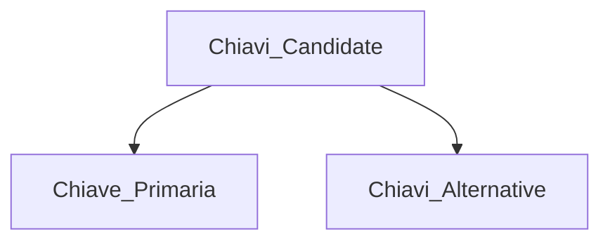
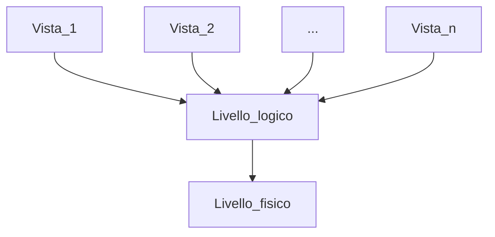

# Basi di dati

## Obbiettivo del corso

Imparare i concetti base relativi ai sistmi di gestione dei dati, ovvero:

- Come progettarli
- Come crearli
- Come ottimizzarli
- Come utilizzarli.

> Modello dei dati
> **Relazionali** ➔ usano la struttura dati della relazione come modo di organizzare

## Aspetti Introduttivi

**BASI DI DATI**

> Collezione di dati tra loro correlati, utilizzati per rappresentare le informazioni di interesse in un sistema informativo.

**SISTEMA DI GESTIONE DI BASI DI DATI (BDSM)**

> Sistema di software che fornisce gli strumenti necessari per gestire i dati.

**SISTEMA INFORMATIVO**

> Gestisce e rende disponibili attraverso strumenti, le informazioni di interesse supportato da un calcolatore.

_Componenti_:

- Strumenti per la rappresentazione delle **_informazioni_**, mediante una qualche codifica.
- **_Programmi Applicativi_** e di sistema che realizzano tutte le funzioni necessarie alla gestione delle informazioni.

Informazioni ➔ Sotto forma di **DATI**.

> Hanni bisogno di un contesto interpretativo che permette di estrarre da essi le info di interesse per gli utenti (es. Matricola, Numero_telefono, ecc...)

## DBMS (DATA BASE MANAGEMENT SYSTEM)

Sistema software in grado di gestire collezioni di dati che siano:

- Grandi
- Condivisi
- Persistenti

  > Cioè tempo di vita non limitato a quello dell'esecuzione dei programmi che li utilizzano.

  Assicurando la loro affidabilità e sicurezza.

**_STRUMENTO VINCENTE_** ➔ **_SCHEMA LOGICO_** ➔ Descrive la struttura dei dati.

**_CARATTERISTICHE_**

- Dimensioni maggiori della memoria centrale disponibile;
- Condivisione dei dati tra applicazioni ed utenti, **risorsa integrata**, condivisa da più settori aziendali ➔ Gestisce la concorrenza:
  - Riduzione della ridondanza dei dati;
  - Riduzione delle inconsistenze tra dati;
  - Meccanismo di controllo dell'accesso concorrente.
- Sicuri ➔ Con meccanismo di cloud, backup;
- Efficienza ➔ sia in tempo che in spazio, capacità di svolgere le operazioni utilizzando risorse accettabili dall'utente;
- Efficacia ➔ Capacità di rendere produttive le attività degli utenti.

Estende le funzionalità del file system fornendo più servizi ed in maniera **integrata**.

**Necessità di usare**:

- Insieme di strutture dati;
- Linguaggi per:
  - specificare dati;
  - aggiornare strutture;
  - specificare vincoli su strutture;
  - manipolare/cercare dati.

**Istanza** ➔ Insieme di dati presenti in un determinato momento in una struttura dati.  
**Tuple** ➔ righe quando si parla di **relazioni**.

La rappresentazione dei dati in un **DBSM** opera su due livelli:

- Fisico
- Logico

### INDIPENDENZA DEI DATI

- **Indipendenza Fisica** ➔ l'amministrazione del database può modificare lo schema fisico del database senza alterare lo schema logico e le viste
- **Indipendeza Logica** ➔ la presenza delle visite permette di nascondere modifiche alla rappresentazione dei dati al livello logico delle applicazioni/utenti che vedono la rappresentazione esterna (tramite vista)
  - Esempio: Cambia lo schema logico (aggiunta di un attributo), solo una parte delle viste cambia

### LINGUAGGI DI UN DBMS

#### DATA DEFINITION (DDL)

- Permette di specificare e modificare lo **schema** della base di dati, lo schema delle viste;
- Livello logico ed esterno.

#### DATA MANIPULATION LANGUAGE (DML)

- Permette di creare, modificare ed interrogare attraverso query **l'istanza** della base di dati;
- Livello logico ed esterno.

#### STORAGE DEFINITION LANGUAGE (SDL)

- Definisce lo schema fisico del DB;
- Livello Fisico.

**Il linguaggio SQL ha comandi di entrambi i linguaggi (DDL/DML).**

## IL MODELLO RELAZIONALE

- Proposto nel 1970 per favorire l'indipendenza dei dati, reso disponbile come modello logico in DBMS nel 1981;
- Modello logico più diffuso ed adottato per livelli commerciali.

### CARATTERISTICHE

- Basato su una semplice struttura di dati ➔ **LA RELAZIONE**:
  - **DEF**: Sottoinsieme finito del prodotto cartesiano;
  - si associa un nome a ogni componente delle colonne (**TUPLE**) ➔ **nome di attributo**;
  - ogni relazione è rappresentata in maniera informale sotto forma di **tabella**.
- É caratterizzato da precise basi matematiche;
- Semplice rappresenzione di dati con linguaggi dichiarativi:
  - anche per utenti poco esperti;
  - possibilità di attuare strategie di ottimizzazione.
- Facilità con cui possono essere espresse interrogazioni;
- É possibile rappresentare l'assenza del valore per un attributo poichè non tutte le info sono sempre disponibili:
  - valore speciale ➔ **NULL** ➔ **valore sconosciuto**.

**DOMINIO** ➔ insieme di valori (anche infinito) che i dati possono assumere

> valori nulli non appartengono al dominio

**PRODOTTO CARTESIANO** ➔ insieme di oggetti (tuple) strutturati che hanno **K** componenti, tanti quanti sono i domini), dove il **K-Esimo** valore appartiene al **K-Esimo** dominio


**Grado** ➔ Elementi presenti in una tupla (colonne della tabella), **k** domini = grado **k**.  
**Cardinalità** ➔ Numero di tuple (righe della tabella).

### LE CHIAVI

**Vincolo di chiave**  
La chiave di una relazione **è un insieme di attributi che distingue fra loro le tuple della relazione.**

**Proprietà**
Sia S uno schema relazionale:

- Qualsiasi insieme di tuple sia contenuta in S, non devono esistere 2 tuple distinte di S che abbiano lo stesso valore ➔ **_Unicità_**
- Nessun sottoinsime proprio di X degli attributi di S verifica la proprietà 1 ➔ **_Minimalità_**
- **Non** può assumere valori nulli ➔ **_Vincolo di obbligatorietà_**

| Matricola | Nome     | Cognome | DataN     | Anno Immatricolazione |
| --------- | -------- | ------- | --------- | --------------------- |
| 64655     | Marco    | Rossi   | 3/2/1988  | 2008                  |
| 81999     | Anna     | Bianco  | 16/6/1989 | 2008                  |
| 75222     | Giovanni | Gialli  | 4/5/1987  | 2007                  |

L'attributo { Matricola } è univoco e minimale, **quindi è una chiave.**  
L'insieme di attributi { Matricola, Nome } è univoco, ma non minimale (Matricola è univoco anche da solo), quindi è una **super chiave**.

#### Chiavi Candidate



- Una relazione può avere più di un insieme di X atributi che verificano le proprietà 1 e 2;
- Una relazione ha sicuramente almeno una chiave;
- Criteri di Scelta:
  - Chiave candidata contenente il minor numero di attributi;
  - Chiave candidata più frequentemente utilizzata nelle query, in modo da velocizzare il carico di lavoro.

#### Chiavi Esterne

Servono per modellare le associazioni (**non** aggiunge ulteriori informazioni), creano un legame tra attributi.


- Una relazione può contenere **più chiavi esterne** anche verso la stessa tabella;
- Devono essere specificate nello schema della relazione;
- Devono rispettare l'**integrità referenziale** ➔ correttezza violata da:
  - Inserimenti e modifiche del valore della chiave esterna nella relazione referente;
  - Cancellazioni e modifiche del valore della chiave nella relazione riferita:
    - SQL mette a disposizione queste alternative:
      - cancella o modifica tutti i noleggi che si riferiscono al cliente cancellato ➔ ON UPDATE / ON DELETE ➔ CASCADE
      - Non consente la cancellazione o la modifica se ha ancora noleggi in corso ➔ ON UPDATE / ON DELETE ➔ RESTRICT
      - Esegue senza problemi l'inserimento e la cancellazione senza fare altro ➔ ON UPDATE / ON DELETE ➔ NO ACTION
      - Consente la cancellazione o modifiche cambiando il codice cliente con un valore nullo o di default per mantenere noleggi ➔ ON UPDATE / ON DELETE ➔ SET NULL / SET DEFAULT
- possono assumere valore nullo

**ESEMPIO:**

```SQL
CREATE TABLE Autore (
  Nome VARCHAR(50) NOT NULL,
  Cognome VARCHAR (50) NOT NULL,
  Data_Nascita DATE NOT NULL,
  Nazionalità VARCHAR(50) NOT NULL,
  PRIMARY KEY (Nome Cognome)
);
```

```SQL
CREATE TABLE Libro (
  Titolo VARCHAR(50) NOT NULL,
  Nome_Autore VARCHAR (50) NOT NULL,
  Cognome_Autore VARCHAR (50) NOT NULL,
  Lingua VARCHAR(20) NOT NULL,
  FOREIGN KEY AutoreDelLibro (Nome_Autore, Cognome_Autore) REFERENCES Autore(Nome, Cognome)
);
```

### VINCOLI DI INTEGRITA' E ASSERZIONI

#### Vincoli di integrità

Vincoli che esprimono condizioni di correttezza dei dati nelle tabelle, qualsiasi applicazione che accede deve riconoscere questi vincoli, in base alle informazioni di dominio;

- Il **dominio degli attributi** è un vincolo ➔ Int, String, DataSet;
- Vincoli di **obbligarietà di colonne** ➔ NOT NULL
- Vincoli di **chiave** ➔ UNIQUE e PRIMARY KEY
- Vincoli di **integrità referenziale** ➔ FOREIGN KEY

Il linguaggio di query SQL mette a disposizione anche altri costrutti per la specifica di generici **vincoli di integrità**.

- Nel comando **CREATE TABLE**, è possibile definire:
  - Vincoli **CHECK** su colonna seguiti da condizione (anche con sub-query)
    - Si definiscono alla definizione degli attributi.

```SQL
CREATE TABLE Video (
tipo CHAR NOT NULL CHECK (tipo IN('d', 'v'))
)
```

- Vincoli **CHECK** su relazione:
  - Mettono in relazione più colonne o attributi;
  - Si mettono come definizione a parte;

**Cosa succede in presenza di valori nulli?**
SQL usa una logica a 3 valori per valiutare le condizioni (TRUE - FALSE - UNKNOWN)
E' possibile dare un nome ai vincoli (anche a quelli di default) in modo tale da essere inseriti o cancellati, facendo seguire la specifica del vincolo dalla parola **_CONSTRAINT_**.

```SQL
CREATE TABLE Video(
  colloc DECIMAL(4) CONSTRAINT PKey PRIMARY KEY,
  titolo VARCHAR(30) CONSTRAINT Tnn NOT NULL,
  regista VARCHAR(20) CONSTRAINT Rnn NOT NULL,
  tipo CHAR CONSTRAINT Snn NOT NULL DEFAULT 'd' CONSTRAINT Tok CHECK (tipo IN('d','v')),
  CONSTRAINT FK FOREIGN KEY (titolo, regista));

  ALTER TABLE Video DROP CONSTRAINT Tok;
```

Possibilità di definire **ASSERZIONI**.  
Sconsigliabile esprimere tramite vincoli **CHECK** condizioni troppo complesse, poichè altrimenti ci sarà una scarsa comprensibilità dello schema.
Non è possibile, inoltre, specificare tramite vincoli **CHECK** condizioni che richiedono di esaminare tuole di relazioni diverse:

- Sono elementi dello schema, manipolati da comandi **DDL**;
- Servono per esprimere **vincoli d'integrità** che coinvolgono **tuple o relazioni**.

#### Sintassi

```SQL
CREATE ASSERTION <nome asserzione>
CHECK (<condizione>)
```

Esempio:

Uno stesso video non può essere noleggiato contemporaneamente da due clienti.  
Un video non può essere noleggiato prima dell'uscita del film che lo contiene.

```SQL
CREATE ASSERTION DateOk
CHECK (NOT EXISTS SELECT * FROM Noleggio NATURAL JOIN Video NATURAL JOIN Film WHERE EXTRACT (YEAR FROM DataNol) < anno)
```

### LINGUAGGIO SQL

E' un linguaggio **SET-ORIENTED**:

> orientato agli insiemi

- Gli operatori operano su relazioni (insieme di tuple);
- Il risultato è sempre la relazione.

Utilizzabile in due modalità:

- **Interattiva** ➔ query da riga di terminale e DBMS restituisce il risultato
- **Compilativa** ➔ un linguaggio oapite contiene istruzioni SQL

|   Operazione   |  DDL   |  DML   |
| :------------: | :----: | :----: |
|   creazione    | CREATE | INSERT |
|    modifica    | ALTER  | UPDATE |
| cancellazione  |  DROP  | DELETE |
| interrogazione |        | SELECT |

**DDL** (schema logico) ➔ tabella, lista
**DML** (livello d'istanza) ➔ variazioni su tuple della tabella

#### Tipi di stato

Suddivisi in:

- **Tipi predefiniti**:
  - tipi carattere ➔ CHAR - VARCHAR;
  - tipi numerici ➔ DECIMAL (numero totale di numeri, cifre dopo la virgola);
  - tipi temporali ➔ DATA - CURRENT_DATE
    - EXTRACT (YEAR, DAY, MONTH FROM <attributo>) ➔ funzione che serve per estrarre da una data un giorno/ mese/ anno;
  - Booleani;
  - BLOB, CLOB: per grandi immagini e testi.
- **Tipi user-defined** ➔ creare tipi di dato, vanno parte delle caratteristiche obect-relational.

#### DDL : creazione di relazioni

```SQL
CREATE TABLE Prodotti(
  codP CHAR(6) PRIMARY KEY,
  nomeP VARCHAR(20) UNIQUE NOT NULL,
  colore VARCHAR(6),
  taglia SMALLINT,
  magazzino VARCHAR(15)
);
```

- se ci sono due chiavi primarie si scrive ➔ **PRIMARY KEY (A1, A2)**;
- se ci sono 2 chiavi alternativa si scrive ➔ **UNQUE (A1, A2)**;
- la combinazione **UNIQUE NOT NULL** permette di definire una chiave alternativa che non ammette valori **sconosciuti (?)**;

```SQL
CREATE TABLE Video(
  colloc DECIMAL(4) PRIMARY KEY,
  titolo VARCHAR(30) NOT NULL,
  regista VARCHAR(20) NOT NULL,
  tipo CHAR NOT NULL DEFAULT 'd',
  FOREIGN KEY (titolo, regista) REFERENCES Film
);
```

- la specifica di chiave esterna nella definizione della tabella si scrive **FOREIGN KEY**:
  - deve essere accompagnata da nome relazione puntata ➔ **REFERENCES < nome relazione >**

```SQL
CREATE TABLE Noleggio(
  colloc DECIMAL(4) REFERENCES Video ON DELETE CASCADE ON UPDATE CASCADE,
  dataNol DATE DEFAULT CURRENT_DATE,
  codCli DECIMAL(4) NOT NULL REFERENCES Cliente ON DELETE CASCADE ON UPDATE CASCADE,
  dataRest DATE,
  PRIMARY KEY (colloc, dataNol),
  UNIQUE (colloc, dataRest)
);
```

- **CANCELLAZIONE E MODIFICA** di tabelle referenti:

  - **CASCADE** ➔ cancella gli elementi presenti anche nella tabella riferita;
  - **NO ACTION** ➔ non permette la cancellazione;
  - **SET NULL**;
  - **SET DEFAULT**.

---

#### DDL: gestione delle relazioni

- **CANCELLAZIONE:**
  - **DROP TABLE** < nome relazione >
    - **CASCADE** ➔ cancella le tabelle a cui fa riferimento;
    - **RESTRICT** ➔ elemento _non rimosso_ se è presente in qualche definizione di un altro elemento (di default)
- **MODIFICARE:**
  - **ALTER TABLE** < nome relazione > < operazione di modifica >
    - aggiunta nuova colonna ➔ **ADD < specifica colonna >**;
    - definire/cancellare/modificare valori default per una colonna esistente ➔ **ALTER** < nome colonna >
      - **SET DEFAULT** < valore default >
      - **DROP DEFAULT**
    - eliminazione colonna ➔ DROP < nome colonna >
    - definizione vincolo integrità ➔ **ADD COSTRAINT** [nomevincolo]< specifica vincolo >
    - eliminazione vincolo integrità esistente ➔ **DROP CONSTRAIN** < nome vincolo >

---

#### DML: linguaggio di query

- operazioni di ricerca e interrogazioni
- fanno parte del **DML**

##### Formato base

**clausola di protezione**:
**SELECT** < tabella. colonna dalla quale voglio ricevere le informazioni>

> l'asterisco prende tutte le colonne (\*)

- **DISTINCT** se sono interessato a eliminare le tuple duplicate da un risultato;
- **CONCAT()** per concatenare le stringhe in una unica colonna.

**clausola FROM**
**FROM** < tabella o relazioni oggetto della ricerca >

**clausola di qualificazione**
**WHERE** < condizioni particolari > uso di espressioni booleane AND e OR

- la valutazione del predicato si fa tupla per tupla;
- questa clausola è opzionale;
- valori stringa sono inclusi in apici ('').

##### Operatori particolari con WHERE

- operatore **BETWEEN** ➔ non aggiunge potere espressivo al linguaggio, utile per rendere più evidente l'espressione cercata (range di valore, ha senso con operatori di tipo numerico);
- operatore **NOT BETWEEN** ➔ contrario di **BETWEEN** che segue lo stesso ragionamento;
- operatore **IN** ➔ analogo all'operatore di appartnenza insiemistica (appartiene), sostituisce l'**OR**;
  - esempio: **WHERE genere IN ('horror', 'fantascienza')** sostituisce **WHERE genere 'horror OR genere 'fantascienza'**.
- operatore NOT IN ➔ un elemento che non appartiene all'insieme;
- operatore **LIKE** ➔ verifica che un attributo di tipo stringa segua particolari condizioni (PATTERN MATCHING)
  - esempio: WHERE titolo LIKE '\_\_%d' (trova i titoli che hanno la 'd' come terza lettera):
    - \_\_ ➔ rappresenta un carattere;
    - % ➔rappresenta una sequenza qualsiasi di **n** caratteri (anche vuota).

##### Espressioni

Si possono usare:

1. nella clausola di proiezione (SELECT)
2. nella clausola di qualificazione (WHERE)

- posso mettere anche degli operatori (+ - / \*) con espressioni:
  - es: SELECT codiceFiscale, stipendio + premi.
- posso rinominare la colonna contenente l'espressione con la parola chiave **AS**:
  - es. SELECT stipendioAnnuale/12 AS stipendioMensile.

##### Ordinamento del risultato

In genere l'ordine delle tuple risultato dell'interrogazione è determinato dal sistema (dipende dalla strategia utilizzata dal sistema).

E' possibile specificare un ordinamento diverso aggiungendolo alla fine dell'interrogazione la clausola **ORDER BY**, seguita da una lista di nomi di colonnne:

- **ASC** ➔ ordinamento crescente (default);
- **DESC** ➔ ordinamento decrescente.

**Gli attributi di ordinamento devono comparire nella clausola di SELECT** (anche implicitamente ➔ SELCT \*).

#### DML: Istruzioni di aggiornamento

Modifiche all'istanza della base di dati sono **molto frequenti**.
Tre comandi forniti per la manipolazione:

- **INSERT** ➔ inserimento di tuple
  1. **una sola tupla** ➔ assegnazione di un **valore costante** ad ogni attributo;
  2. **più tuple** ➔ lette da altre tabelle mediante una **SELECT**.

##### Sintassi Insert

```SQL
INSERT INTO <nomeTabella> VALUES ('')

INSERT INTO <nomeTabella>
SELECT <attributi>
FROM <nomeTabella>
WHERE <condizione> o SUBQUERY
```

**NOTA BENE**
La query non può contenere la clausola ORDER BY, poichè il DBMS inserisce le tuple con un proprio ordine ottimizzato.

- **UPDATE** ➔ modifica di tuple esistenti

##### Sintassi Update

**UPDATE** < nome tabella >
**SET C1** {nuovo valore}

**UPDATE** < nome tabella >
**SET C1** {nuovo valore}
**WHERE** < condizione > o **SUBQUERY**

- **DELETE** ➔ cancellazione di tuple, mantenendo lo schema

##### Sintassi Delete

**DELETE FROM** < nome tabella >

**DELETE FROM** < nome tabella>
**WHERE** ➔ Condizione da cancellare la tupla o **SUBQUERY**.

**NOTA BENE**
Con le operazioni di aggiornamento è necessario verificare che siano rispettati i vincoli di integrità.
Ogni istruzione può modificare il contenuto di **una sola tabella**.

#### LE VISTE



> Le viste sono presenti solo in DB con schemi medio-grandi.
> Livello logico e livello fisico sono sempre presenti.

Viene utilizzata quando si vuole dividere gli accessi, in basei ai diritti e alle priorità di chi utilizza il database.

> **Esempio:**
> Lo studente ha accesso solo ad una parte del database nel momento che si registra all'esame.

- è una **relazione virtuale** ➔ creata runtime ogni volta che andrò ad interrogarla:
  - contenuto definito mediante un'interrogazione SQL sulla base di dati;
- il contenuto **non è memorizzato fisicamente** nel database.

Utile per:

- semplificare accesso ai dati;
- fornire indipendenza logica ➔ quando cambio lo schema logico non tutte le viste vengono modificate poichè non contengono dati modificati;
- garantire protezione dei dati.

##### Struttura

**_CREAZIONE_**

**CREATE VIEW** < nome vista > [(< lista nomi colonne >)]
**AS** < interrogazione >

- < lista nomi colonne >
  - non è obbligatoria, tranne nel caso l'interrogazione contenga nella clausola di proiezione colonne virtuali a cui non è assegnato un nome;

**_ELIMINAZIONE_**

**DROP VIEW** < nome vista >

#### Esempi

**Vista contenente il codice cliente, la data di inizio noleggio e la collocazionne dei video in noleggio da più di tre giorni.**

```SQL
CREATE VIEW nol3gg AS
SELECT codCli, dataNol, colloc
FROM Noleggio
WHERE dataRest IS NULL AND dataNol + 3 <CURRENT_DATE>;
```

I nomi delle colonne della vista sono codCLi, dataNol e colloc.

**Vista che, per ogni cliente, contiene il codice, il numero di noleggi effettuati e la durata massima in giorni di tali noleggi:**

```SQL
CREATE VIEW infoCli (codCli, numNol, durataM) AS
SELECT codCli, COUNT(*), MAX((dataRest-dataNol) DAY)
FROM Noleggio
GROUP BY codCli;
```

- Quando le colonne sono calcolate nella Query di definizione devono andare a definire il nome che avranno le viste.

**_AGGIORNAMENTO_**

- L'esecuzione di un'operazione di aggiornamento su vista **deve poter essere propagata sulle relazione su cui la vista è definita**.

> **RISPETTARE I VINCOLI**
> Sono permessi solo operazioni di aggiornamento che riesco a mappare in modo univoco in analoghe relazioni su cui la vista è definita.

Molti DBMS consentono operazioni di aggiornamento solo su viste definite **su una singola relazione** e ponendo delle restrizione sulla query di formulazione (ad esempio non deve contenere **GROUP BY, JOIN etc.**

#### CHECK OPTIONS

Per assicurare anche le tuple aggiornate tramite una vista siano accettate solo se verificano la condizione nell'interrogazione di defnizione della vista.

```SQL
CREATE VIEW <nome vista> [(<lista nomi colonne>)]
AS <interrogazione>
[WITH[{LOCAL | CASCADED}] CHECK OPTION]
```

Vengono definite solo su aggiornamenti di viste create in altre viste (**v1** e **v2**).

- **LOCAL** ➔ un aggiornamento in v2 deve soddisfare solo la condizione in v2;
- **CASCADE** ➔ un aggiornamenti in v2 deve soddisfare sia la condizione di v1 che la condizione di v2

#### Esempio

Se abbiamo Nol3gg definita come:

```SQL
CREATE VIEW Nol3gg AS SELECT codCli, dataNol, colloc
FROM Noleggio
WHERE dataRest IS NULL AND (CURRENT_DAETE - dataNol) DAY > INTERVAL '3' DAY;
WITH [LOCAL] CHECK OPTION;
```

L'inserimento di tuple che non soddisfano l'interrogazione di defnizione della vista, come (1128, CURRENT_DATE, 6635), non è permesso.

```SQL
CREATE VIEW PRODOTTI_TAGLIA_MEDIA_O_GRANDE AS
SELECT CodP, NomeP, Taglia
FROM P
WHERE Taglia >= 42 WITH CHECK OPTION;
```

**Check option** poichè il controllo è definito su una sola vista potrò fare l'aggiornamento solo se la taglia è >= 42.

```SQL
CREATE VIEW PRODOTTI_TAGLIA_MEDIA AS
SELECT CodP, NomeP, Taglia
FROM PRODOTTI_TAGLIA_MEDIA_O_GRANDE
WHERE Taglia <= 46 WITH CASCADED CHECK OPTION;
```

Viene creata una vista nella vista precedente con taglie comprese tra 42 e 46:

- con **WITH CASCADE CHECK OPTION**
  - l'aggiornamento deve soddisfare non solo taglia <= 46 ma anche taglia >= 42
- con **WITH LOCAL CHECK OPTION**
  - l'aggiornamento deve soddisfare solo la condizione locale taglia <= 46

#### QUERY CON PIU TABELLE NELLA CLAUSOLA FROM

##### Operazione di JOIN

- il Join di due relazioni A e B serve per generare tutte le coppie formate da una tuola di A r una tupla di B "Legate semanticamente";
- consente di attraversare le relazione rappresentate mediante le **chiavi esterne**;
- l'argomento delle relazioni (tabelle) va nella clausola **FROM**
  - il DBMS fa il prodotto cartesiano di queste tabelle
  - a questo prodotto risultante è applicata una selezione in base al predicato **JOIN** nella clausola **WHERE**;

Trovare il **nome dei corsi** e il **cognome del docente** che li tiene:

|  idC  |   corso    | CFU | idDoc |
| :---: | :--------: | :-: | :---: |
| 53688 | Topologia2 |  6  |  720  |
| 53689 |  Storia1   | 12  |  414  |
| 53666 |  Storia2   | 18  |  414  |

| matr | cogn  |  login   |
| :--: | :---: | :------: |
| 710  | Jones | jones@cs |
| 414  | Smith | smith@ee |
| 720  | Evams | evams@ee |

```SQL
SELECT corso, cognome FROM Corso, DOcente
WHERE Corso.idDoc = Docente.matr;
```

Sono operazioni costose, si deve quindi cercare di farlo su tabelle di piccole dimensioni.
JOIN ALTERNATIVI

- **JOIN ON** direttamente nella clausola FROM
- **JOIN USING** (colonne comune che hanno stesso nome) - direttamente in FROM
- **JOIN NATURAL** (rischioso - si usa solo quando abbiamo una colonna con lo stesso nome)

ALIAS di relazioni

###### **OUTER JOIN**

**Usato quando la relativa tuola di una tabella non ha il suo corrispondente nell'altra**.

> **ESEMPIO**
> video di tim burton che sta nella tabella VIDEO, non è stato ancora noleggiato e quindi non è presente nella tabella NOLEGGIO

Aggiunge al risultato di join le tuple di T o S (o entrambi) che nonn hanno partecipato alla join (non avenfo corrispondenti), completandole con null

T _OUTER JOIN_ S

- **FULL** ➔ sia le tuple di T che di S vwngono completate ed inserite nel risultato;
- **LEFT** ➔ le tuple di T che non partecipano vengono completate ed inserite nel risultato;
- **RIGHT** ➔ le tuple di S che non partecipano vengono completate ed inserite nel risultato.

Per ogni video contenente un film di Tim Burton vogliamo visualizzare la sua collocazione, il titolo ed i codici dei clienti che l'hanno **eventualmente** noleggiato:

```SQL
SELECT colloc, titolo, codCli
FROM Video
NATURAL LEFT OUTER JOIN Noleggio
WHERE regista = 'Tim burton'
```

#### FUNZIONI DI GRUPPO

Nelle espressioni della **clausola di proiezione (SELCT)** possiamo avere anche espressioni che calcolano valori a partire da **insieme** di tuple (anche contemporaneamente), come ad esempio:

- media stipendi
- massimo voto conseguito

Operano su **insieme** di valori ➔ producono come risultato un **unico** valore (aggregato)

Possono essere utilizzate a loro volta n espressioni aritmetiche:  
esempio:  
SUM(valutaz)/COUNT(+).  
Si può rinominare la colonna virtuale creata dal risultato con la parola chiave AS.

##### Principali

- MAX(): determina il massimo in un insieme di valori;
- MIN(): determina il minimo in un insieme di valori;
- SUM(): esegue la somma dei valori in un insieme (solo valori numerici);
- AVG(): esegue la media aritmetica di un insieme di valori (solo valori numerici);
- COUNT(): determina la cardinalità di un insieme:
  - come argomento ➔ conta il numero di tuple.

```SQL
SELECT MIN(valutaz), AVG(valutaz), MAX(valutaz)
FROM Film
WHERE genere = 'drammatico';
```

Tutte le funzioni di gruppo possono essere usate con il qualificatore **DISTINCT**.

- eventuali valori duplicati **sono eliminati** prima di applicare la funzione;
- significativa solo per: SUM, AVG e COUNT.

I **valori null** vengono **eliminati** prima del calcolo della funzione di gruppo.

```SQL
SELECT COUNT(DISTINCT Reddito) FROM Persone;
```

I vincoli sono:

- non possono mettere nome di attributo nella proiezione se è presente uuna funzione di gtuppo se non espresse su partizioni delle relazioni;
- non possono mettere i gruppi di funzioni nella clausola WHERE se non con sotto interrogazioni;
- gli attributi univocamente determinati da GROUP BY possono essere reinseriti nella clausola senza problemi.

##### RAGGRUPPAMENTO

Le funzioni di gruppo possono essere usate su **partizioni nelle relazioni**.

- Tuple che hanno **valore uguale** per un determinato attributo.

Le colonne da usare nel partizionamento sono specificate nella clausola **GROUP BY**.
Per ogni regista vogliamo determinare quanti suoi film sono presenti nel catalogo, di quanti generi diversi e la valutazione minima, media e massima di tali film:

```SQL
SELECT regista
COUNT(*) AS numF,
COUNT (DISTINCT genere) AS numeroG,
MIN(valutaz) AS minV,
AVG(valutaz) AS avgV,
MAX(valutaz) AS maxV,
FROM Film
GROUP BY Regista;
```

Si può escludere alcuni gruppi dal computo delle interrogazioni

- condizione definita su valori aggregati;
- **non** è possibile usare la clausola **WHERE**.

La clausola **HAVING** permette di specificare condizioni su valori aggregati (coinvolgono funzioni di gruppo).  
Per ogni regista **che ha girato almeno due film** prima del 2000, determinare quanti sono tali film, di quanti generi diversi e la valutazione minima, media, massima fi tali film:

```SQL
SELECT Regista,
COUNT(DISTINCT Genere) AS numG,
MIN (valutazione) AS minV,
AVG (valutazione) AS avgV,
MAX (valutazione) AS maxV,
FROM Film,
WHERE anno < 2000
GROUP BY Regista
HAVING COUNT(*) >= 2;
```

#### OPERAZIONI INSIEMISTICHE

La clausola SELECT da sola non consente di eseguire operazioni su insiemi.

##### UNIONE

- A e B ricavate dalla clausola SELECT;
- A UNION B ➔ genera tabella dove ho le tuple di A unite a quelle di B;
- Il nome del risultato **tabella unione** è dato dall'attributo A, ovvero quello utilizzato nella prima query di selezione (basta rinominare la prima query eseguita con AS).

###### Limiti Unione

- stesso numero di attributi;
- stesso dominio di definizione;
- tiene conto di una **notazione posizionale**;
- rimuove duplicati;
- **UNION ALL** ➔ non elimina i duplicati.

##### INTERSEZIONE

A **INTERSECT** B ➔ genera tabella dove ho le tuple restituite sia di A che di B.

###### Limiti Intersect

- stesso numero di attributi;
- stesso dominio di definizione;
- tiene conto di una **notazione posizionale**.

##### DIFFERENZA

A **EXCEPT/MINUS** B ➔ Genera tabella dove tolgo da A le tuple restituite da B.  
Trovare il codice dei clienti che non hanno noleggiato film di Tim Burton:

```SQL
SELECT codCli
FROM Cliente
EXCEPT
SELECT codCli,
FROM Noleggio NATURAL JOIN Video
WHERE regista = 'tim burton'
```

**NOTA BENE**  
La stessa query può essere eseguita con **NOT IN** e una **SUBQUERY**

###### LIMITI DIFFERENZA

- stesso numero di attributi;
- stesso dominio di definizione;
- tiene conto di una **notazione posizionale**.

##### SOTTOINTERROGAZIONI (SUB QUERY)

Possibilità di annidare interrogazioni SQL in altre interrogazioni SQL ➔ istruzioni SELECT contenuta all'interno di un'altra interrogazione:

E' possibile introdurre **sotto-interrogazioni** in:

- un predicato nella clausola WHERE, usata per:
  - determinare uno o più valori

### Che cos’è un DBMS e quali servizi offre?\*\*

Un DBMS, acronimo di Database Management System è un sistema creato per consentire la creazione, la manipolazione e l’interrogazione efficiente di database.
Offre servizi di manipolazione e di ricerca dei dati presenti all’interno di un database insieme a funzionalità di creazione, eliminazione e aggiornamento di strutture dati.

**Architettura a 3 livelli di un DBMS**  
I moderni DBMS seguono l’impostazione concettuale dell’architettura a 3 livelli; i dati vengono
descritti secondo 3 diversi livelli di astrazione: **il livello esterno, il livello logico ed il livello interno.**

- Il livello esterno rappresenta ciò che l’utente vede del database, o meglio ciò che gli è concesso vedere; in generale esistono tanti schemi esterni quante sono le “classi” di utenti che hanno differenti esigenze/diritti di accesso alla base di dati;
- Il livello logico rappresenta la visione integrale del database, indipendentemente dalle tecniche di memorizzazione dei dati. Naturalmente esiste un solo schema logico per ogni database;
- Il livello interno coincide con la rappresentazione fisica del database nel computer.

---

### Indipendenza logica e fisica in un DBMS

L’architettura a 3 livelli dei database realizza meccanismi di astrazione dei dati e ne assicura l’indipedenza: i livelli “superiori” dell’architettura non sono influenzati (in certi limiti) da ciò che
succede nei livelli a loro inferiori. Si identificano due livelli: **indipendenza logica** ed **indipedenza fisica**

- Con indipendenza logica dei dati si fa riferimento alla capacità dello schema esterno di non essere influenzato dai cambiamenti apportati allo schema logico. Aggiungere un campo ad una certa tabella non avrà alcun effetto sulle viste.
- Con indipendenza fisica dei dati si fa riferimento alla capacità dello schema esterno di non essere influenzato dai cambiamenti apportati allo schema interno. _Cambiare il dispositivo di memorizzazione nel quale è situata la tabella non comporterà nessun cambiamento allo schema logic (e di conseguenza nemmeno agli schemi esterni), rendendo di fatto il cambiamento trasparente agli utenti_.

---

### Come il DBMS gestisce i valori nulli

In un DBMS il valore null indica l’assenza di informazione, non viene distinto se l’informazione
manca perché è sconosciuta o perché non esiste.
Il DBMS utilizza una logica a tre valori per valutare le condizioni e gestire i valori nulli (TRUE-FALSE-
UNKNOWN). Una tupla per cui il valore di verità è ? non viene restituita dall’interrogazione.
Il predicato IS NULL applicato ad un attributo restituisce TRUE se la tupla ha valore nullo per
l’attributo.
Il predicato IS NOT NULL applicato ad un attributo restituisce TRUE se la tupla ha valore non nullo
per l’attributo.

Illustrare il modello relazionale e spiegarne i vantaggi
Il modello relazionale è uno schema logico in cui la base di dati è vista come un insieme di tabelle
su cui possono essere eseguite delle operazioni. Il suo nome deriva dalla relazione tra che esiste
tra insiemi ed oggetti. Si basa su due concetti di base: relazione e tabella. Vantaggi:
 Favorisce l’indipendenza fisica dei dati
 Permette di rappresentare solamente ciò che è rilevante per l’applicazione
 Tutta l’informazione è contenuta nei valori ed è quindi relativamente semplice da
trasferire.
Caratteristiche linguaggio SQL
SQL è un linguaggio Set-Oriented, orientato agli insiemi. Gli operatori operano su relazioni e il
risultato è sempre una relazione.
è un linguaggio per DBMS che racchiude al suo interno le funzionalità di DML e di DDL
è un linguaggio dichiarativo: non specifica le operazioni svolte per raggiungere un certo risultato
è relazionalmente completo: ogni espressione dell’algebra relazionale è traducibile in SQL
PRINCIPALI FUNZIONALITA’ DDL, DML E SDL
DDL è un’abbreviazione di Data Definition Language, viene utilizzato per definire strutture di dati;
principali funzionalità:
 CREATE permette di creare il database ed i suoi oggetti (tabelle, viste)
 ALTER permette di modificare la struttura del database esistente
 DROP permette di eliminare gli oggetti dal database
 TRUNCATE permette di rimuovere tutti i record di una tabella, inclusi gli spazi allocati per i
record
DML è un’abbreviazione di Data Manipulation Language, si occupa della manipolazione dei dati;
viene utilizzato per archiviare, modificare, aggiornare ed eliminare oggetti nel database; principali
funzionalità:
 SELECT permette di recuperare i dati da un database
 INSERT permette di inserire i dati in una tabella
 UPDATE permette di aggiornare dati già esistenti in una tabella
 DELETE permette di eliminare i record da una tabella del database
SDL è un’abbreviazione per Simple Mediadirect Layer, si tratta di un linguaggio che permette di
definire lo schema fisico del DB
DEFINIZIONE DI CHIAVE E DI CHIAVE ESTERNA
Una chiave è un campo o un insieme di campi utilizzata per recuperare ed ordinare le righe in una
tabella in base a specifici requisiti, viene spesso utilizzata per definire collegamenti tra le diverse
tabella di un DB; una tabella per essere definita tale deve rispettare delle proprietà: Univocità,
obbligatorietà e minimalità.
Una chiave esterna è una colonna (o un gruppo di colonne) contenente i valori relativi alla chiave
primaria di un’altra tabella. Le chiavi esterne vengono utilizzate per unire le tabelle.

SPIEGARE CHE COSA SONO LE VISTE E A COSA SERVONO

Le viste sono un elemento utilizzato dalla maggior parte dei DBMS, come suggerisce il nome si
tratta di modi diversi di vedere i dati; una vista è rappresentata da una query il cui risultato può
essere utilizzato come se fosse una tabella.
Il contenuto delle viste non viene salvato in memoria, ogni vista viene creata virtualmente in
runtime ogni volta che questa viene interrogata.
Comando creazione: CREATE VIEW AS
Comando cancellazione: DROP VIEW
La CHECK OPTION, invece, è una clausola che fa in modo che le tuple aggiornate all’interno di una
vista vengano accettate solamente nel caso in cui queste rispettino le condizioni contenute
nell’interrogazione di definizione della vista.
SPIEGARE LE TRE SOLUZIONI PER SVILUPPARE UN’APPLICAZIONE CHE SI INTERFACCIA AD UNA
BASE DI DATI, ILLUSTRANDONE PREGI E DIFETTI
Ci sono due diverse strade che possono percorrere: Client side e Server Side.
La prima permette di integrare SQL ad un linguaggio di programmazione già esistente, prende il
nome di Client Side perché il codice viene eseguito in un ambiente diverso dal DBMS. L’approccio
Client Side offre due soluzioni:
La prima riguarda l’utilizzo librerie di funzioni, dette API. Queste definiscono l’interfaccia di
comunicazione tra il DBMS ed il linguaggio di programmazione.
Vantaggi: portabilità garantita dai driver, semplicità e flessibilità
Svantaggi: diminuzione delle performance e difficoltà nella programmazione
La seconda consiste nel SQL integrato: i comandi SQL vengono utilizzati direttamente all’interno
del linguaggio di programmazione.
Vantaggi: programmazione più semplice rispetto alla soluzione precedente
Svantaggi: la compilazione del codice richiede la presenza di un precompilatore che sostituisce i
comandi SQL in chiamate CLI al DBMS; ciò diminuisce le performance.
La terza e ultima soluzione è di tipo Server Side e riguarda le estensioni procedurali: linguaggi di
programmazione che funzionano sui DBMS.
Vantaggi: rendono più facili le operazioni di sviluppo e di esecuzione delle app, garantiscono una
buona performance, sono molto utili per sistemi DATA INTENSIVE
Svantaggi: poca espressività e poca portabilità
