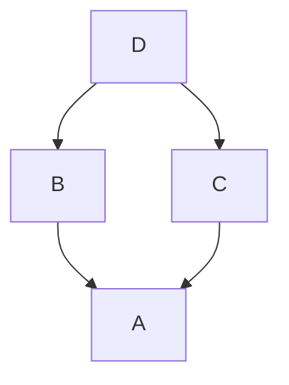

# Progettazione del software

## Qualità

Lo standart **ISO 9126** definisce la **qualità** del software in termini di 6 caratteristiche:

- funzionalità;
- affidabilità;
- usabilità;
- efficienza;
- manutenibilità;
- portabilità.

ciascuna delle quali è a sua volta definita in varie sottocaratteristiche.

### Funzionalità

_Definizione_: L'insieme di attrivuti che riguardano l'esistenza di un complesso di funzioni e delle specifiche proprietà. Le funzioni sono quelle che soddisfano i requisiti stabiliti ed impliciti.

Questaè la caratteristica primaria del software: riguarda _cosa_ deve fare l'applicazione (requisiti funzionali), mentre le altre caratteristiche riguardano _come_ (requisiti non funzionali).

Infatti nella prima versione dello standard, la _funzionalità_ era chiamata _correttezza_.

### Affidabilità

_Definizione_: L'insieme di attributi che riguardano la capacità del prodotto software di mantenere il livello di prestazioni con condizioni e limiti di tempo fissati.  
Questa caratteristica riguarda la frequenza dei malfunzionamenti: nella definizione, la parola "prestazioni" si riferisce al funzionamento corretto ( oppure no) del software e non alla sua velocità.

Per valutare l'affidabilità, bisogna specificare la probabilità che si verifichi un errore:

- in un dato periodo di tempo, (in un periodo più lungo si ha più probabilità di malfunzionamenti);
- usando il software in un determinato modo (con più funzionalità o con un unso più intenso si alza la probabilità di malfunzionamenti).

Nel caso delle applicazioni critiche questo studio viene effettuato attraverso appositi modelli matematici.

_Osservazione_: L'affidabilità del software ha natura diversa rispetto a quella dei sistemi fisici, perchè il software non si logora.

### Usabilità

_Definzione_: L'insieme di attributi che riguardano lo sforzo necessario all'uso del prodotto e alla valutazione individuale di tale uso relativamente a un insieme di utenti prefissato o implicito.

L'usabilità:

- dipende dall'utente per cui il software è stato previsto;
- riguarda non solo gli utenti finali, ma anche installatori, operatori, etc;
- comprende anche lo _sforzo di valutazione_, cioè l'utente deve poter capire se l'applicazione è adatta alle sue esigenze.

### Efficienza

_Definizione_: L'insieme di attributi che riguardano la relazione esistente tra il livello delle prestazioni del prodotto software e la quantità delle risorse necessarie nell'ambito delle condizioni fissate.  
Questa caratteristica si riferisce all'utilizzo di risorse, tra cui:

- tempo;
- spazio di memoria;
- occupazione della banda (per mezzi di communicazione).

### Manutenibilità

_Definzione_: L'insieme degli attributi che riguardano lo sforzo necessario a eseguire le modifiche.

La manutenzione del software si suddivide in 3 tipologie:

- **correttiva** : correzione dei bug;
- **perfettiva** : miglioramento del software mediante l'aggiunta di funzionalità;
- **adattiva** : adeguamento del software cambiando delle specifiche e/o dell'ambiente circostante.

Le sottocaratteristiche della manutenibilità sono:

1. _analizzabilità_: deve essere possibile indicare le porzioni di software da modificare;
2. _modificabilità_: bisogna poter effettuare facilmente le verifiche;
3. _stabilità_: quando si effettua una modifica a una parte del programma, non devono esserci effetti inattesi che richiedono modifiche anche a altre parti;
4. _testabilità_: il risultato delle modifiche deve poter essere convalidato.

### Portabilità

_Definizione_: L'insieme degli attributi che riguardano la capacità del prodotto softwware di essere trasferito da un ambiente ad un altro.

Le differenze tra ambiti possono essere:

- _organizzative_: esempio -> organizzazioni diverse potrebbero avere flussi di informazioni diverse;
- _software_: esempio -> sistemi operativi diversi, ma anche diverse versioni dello stesso SO;
- _hardware_.

### Uso del modello

1. Per ogni sottocaratteristica, si valuta un insieme di misure;
2. Si calcola il punteggio di ciascuna sottocaratteristica, come somma pesata sulle misure (stabilendo i pesi in base alle esigenze dell'ambiente d'uso dell'applicazione);
3. Si calcola il punteggio di ciascuna caratteristica, corrispondente a una somma pesata dei punteggi delle sue sottocaratteristiche;
4. Da una somma pesata dei punteggi delle varie caratteristiche si ricava il punteggio complessivo del software.

In questo modo, è possibile confrontare prodotti diversi e/o stabilire degli obbiettivi (valori di soglia) che una determinata applicazione deve raggiungere per essere adeguata a particolari esigenze.

## Modello di sviluppo a cascata

### Code & Fix

La prima metodologia usata per lo sviluppo del software è stata il "_code&fix_", dove prima si scriveva il codice e dopo si risolvevano gli errori, man mano che venivano trovati.  
Ciò ha portato, negli anni _'60_, alla _crisi del software_: mentre le prestazioni dell'hardware aumentavano in maniera esponenziale, la produttività degli sviluppatori era al massimo stagnante, se non in declino.  
Per risolvere tale crisi, è nata la disciplina del _software engeneering_, che ha introdotto dei modelli formali del processo di sviluppo.

### Modello a Cascata

Il **modello a cascata** (**waterfall**) paragona lo sviluppo di un software alla produzione di un oggetto fisico (una catena di montaggio):

- è composto da una serie di _fasi_, chiamate anche _attività_;
- segue una direzione lineare prevalente da una fase all'altra, senza cicli, che sono considerati dannosi, dato che evitarli permette una pianificazione e un controllo migliori;
- standardizza l'outputdi ciascuna fase, in modo che esso possa essere facilmente usato nelle fasi successive, anche nei casi in cui queste vengono svolte da team diversi.

Le fasi del modello a cascata sono:

1. **studio di fattibilità** (_feasibility study_);
2. **analisi e specifica dei requisiti** (_requirements analisys and specification_);
3. **design**;
4. **codifica e test di unità** (_coding and unit test_);
5. **test di integrazione e di sistema** (_integration and system test_);
6. **messa in esercizio** (_deployment_);
7. **manutenzione** (_maintenance_).

Le prime 3 fasi, chiamate _fasi alte_ (o _early phases_), sono le più importanti, perchè le decisioni effettuate nel corso di queste si riflettono sulle fasi successive. Le fasi restanti, invece, sono chiamate _fasi basse_ (o _late phases_).

### Studio di Fattibilità

- Si effettua un'analisi dei costi/benefici, sia sul breve periodo che a medio-lungo termine;
- Si valuta se conviene sviluppare internamente il progetto o acquistare un prodotto esistente;
- Si considerano le possibili alternative;
- Si determinano le risorse necessarie per il progetto.

_Prodotto_: **Documento di studio di fattibilità** (_Feasibility Study Document_), che contiene:

- una descrizione preliminare del problema (che verrà poi integrata con le informazioni acquisite nelle fasi successive, in particolare la specifica dei requisiti);
- la descrizione delle varie soluzioni possibili;
- stime preliminari dei costi e tempi delle diverse alternative (che, in questa fase, vengono solo elencate, senza effettuare già una scelta).

In pratica per via delle scadenze (_time pressure_) e dei costi (_cost pressure_) dello studio di fattibilità, esso non può essere effettuato in maniera approffondita, soprattutto considerando che, in questa fase, non si è ancora sicuri che il cliente accetterà l'offerta.  
Se, però, lo studio è troppo superficiale, può essere che.

- non vengono esplorate tutte le alternative;
- non vengono determinati correttamente i rischi.

Diventa quindi necessario trovare un equilibrio tra tempi/costi e livello di approfondimento.

### Analisi specifica dei requisiti

Comprende varie attività:

- Analisi del dominio in cui verrà utilizzata l'applicazione;
- Identificazione dei requisiti, cioè di cosa deve fare il software.
  > A tale scopo, è necessario interagire con gli utenti finali (che, in genere, vorrebbero più funzionalità) e con il committente (che solitamente, vorrebbe costi e tempi di realizzazione minori), raggiungendo poi un equilibrio tra le loro richieste mediante un processo di negoziazione e contrattazione.

_Prodotto_: **Documento di analisi specifica dei requisiti** (_equirements Analysis and Specification Document, RASD_), che:

- serve oer la fase di design;
- _ha valore contrattuale_ (si tratta dell'allegato tecnico)

Esso deve rispondere a 5 domande:

1. **Who**: chi (quali figure) userà il sistema;
2. **Why**: perchè sviluppare il sistema e perchè verrà usato dagli utenti (_eventualmente rispetto alle applicazioni fornite dalla concorrenza_);
3. **What**: cosa farà il sistema (e non _How_, cioè come lo farà);
4. **Where**: dove sarà usato il sistema, con quale architettura;
5. **When**: quando e per quanto sarà usato il sistema.

I requisiti specificati nel documento si suddividono in:

- requisiti funzionali;
- requisiti non funzionali;
- requisiti sul processo di sviluppo e manutenzione (ad esempio, il committente può voler seguire i progressi dello sviluppo, imporre scadenze per determinate fasi, etc.).

Tale documento deve inoltre essere:

- **preciso**: deve dire direttamente cosa farà il software, senza lasciare ambiguità;
- **completo**: deve comprendere tutte le funzionalità da implementare;
  > In questo modo, a sviluppo completo, il committente potrà verificare che siano state implementate tutte le funzionalità richieste, e al tempo stesso non potrà richiedere funzionalità aggiuntive senza modificare il contratto.
- **congruente**: non contraddittorio;
- **comprensibile**: non deve contenere linguaggio e/o diagrammi tecnici, dettagli sulla realizzazione, etc., in modo che possa essere compreso dall'utente finale;
- **modificabile**: il software evolve, le modifiche partono dall'aggiornamento dei requisiti.

Infine, possono essere inclusi (ed è fortemente consigliato) anche:

- un manuale utente preliminare;
- un piando di test di sistema, cioè un insieme di casi di test (input e output) da usare, per determinare il funzionamento del software completa, ma che, in questa fase aiutano anche a definire coon precisione i requisiti.

### Design

In questa fase si definisce l'architettura del software:

- **componenti**, detti ancge _moduli_ (possono essere le classi di un linguaggio ad oggetti);
- **relazioni** (_statiche_, come ad esempio l'ereditarietà) tra componenti;
- **interazioni** (_dimaniche_, come ad esempio la chiamata di metodi) tra componenti.

Il design deve essere svolto in modo da supportare lo sviluppo concorrente di componenti diversi e la separazione delle responsabilità (così, nelle fasi successive, ognuno "saprà cosa deve fare").

_Prodotto_: **Documento di design** (_design document_).  
A differenza dei documenti precedenti, questo non deve essere leggibile dall'utente, quindi contiene linguaggio tecnico, con appositi diagrammi, ecc., che permettono di descrivere con precisione l'architettura del sistema.

### Codifica e test di unità

Ciascun modulo viene implementato con il linguaggio di programmazione scelto, e poi testato dallo sviluppatore stesso (per questa fase, non serve un team di testing dedicato).

I test compresi in questa fase sono detti _test di unità_ perchè ciascun modulo (unità) viene testato indipendentemente dagli altri, "come se il resto del mondo non esistesse".

Spesso, la codifica e il testing di un modulo sono effettuate contempopraneamente, sfruttando i risultati dei test per assistere allo sviluppo.

I programmi sviluppati in questa fase comprendono anche la loro documentazione.

### Test di Integrazione e di Sistema

I moduli vengono integrati in (sotto)insiemi, e questi ultimi vengono testati.  
Solitamente, si prevede di avere dei malfunzionamenti, ma non si sa da dove essi si verificheranno. Per questo, conviene procedere in modo incrementale, testando prima i sottoinsiemi semplici, e procedendo via via a quelli più completi/complessi (ad esempio, aggiungendo una classe alla volta: in questo modo, ogni difetto individuato può essere causato solo da interuzioni che coinvolgono la classe appena aggiunta).

In teoria, il test di integrazione assume che le singole unità siano corrette, e che quindi vadano veridicate solo da interazioni. In pratica, invece, si possono ancora avere errori nelle singole unità.  
Dopo il test di integrazione, si effettua un test completo del sistema, svolto internamente all'azienda sviluppatrice per verificare il funzionamentodel prodotto, e infine un test di accettazione. Quest'ultimo coinvolge l'utente, permettendogli di verificare che il funzionamento del software rispetti il contratto.

#### Distribuzione dell'effort

Come esempio, la distribuzione dell'effort calcolata su 125 progetti dell'azienda HP è:

- 18% specifica;
- 19% design;
- 34% codifica e test di unità, di cui:
  - 10% codifica;
  - 24% test di unità.
- 19% test di integrazione e di sistema.

Le distribuzioni di altri progetti presentano alcune variazioni, ma in genere sono piuttoto simili a questa.

_Osservazioni:_

- la codifica vera e propria costituisce solo il 10% dell'effort;
- le varie fasi di testing richiedono, complessivamente, oltre il 50% dell'effort del progetto. Per ridurre tale percentuale, sono state sviluppate delle metodologie che permettono di rendere più efficaci, "potenziare", le fasi precedenti.

### Messa in Esercizio

La manutenzione comprende tutti i cambiamenti effettuati dopo la consegna dell'applicazione.

Spesso questa fase costa, da sola, di più di tutto il resto del progetto (cioè costituisce oltre il 50% del costo totale).  
Infatti nonostante sia descritta dal modello a cascata come una fase sola, la manutenzione richiede in realtà la ripetizione dell'intero procedimento.  
La ripartizione tra i tre tipi di manutenzione è approssimativamente:

- correttiva: 20%
- adattiva: 20%
- perfettiva: 50%

> Il totale non è 100% perchè questi dati sono un'approssimazione.

### Altre Attività

Oltre alle 7 fasi sequenziali del modello a cascata, ci sono alcune attività che venfono effettuate per tutta la durata del ciclo di sviluppo:

- **documentazione**: essa deve essere aggiornata in tute le fasi di sviuluppo. e anche in caso di cambiamenti apportati durante la manutenzione;
- **verifica**: controollare che ciascuna fase rispetti le precedenti (ad esempio, che la fase di design rispetti le specifiche, che il codice rispetti il documento di design, ecc.);
- **management**: attività di gestione che permette l'avanzamento del progetto.

### Dati aneddottici sugli errori

Con le tecniche di ispezione sistematica (che consistono nella lettura del codice, senza esecuzione) si scoprono il 50%-75% degli errori. Tali tecniche hanno comunque dei vantaggi:

- permettono di individuare alcuni tipi di errori che non verrebero mai rilevati con il testing;
- rilevano immediatamente la causa degli errori, mentre il testing ne segnala solo l'esistenza, e quindi deve comunque essere seguito da un'ispezione (per il debugging);
- hanno un costo inferiore del testing;
- si possono applicare anche semilavorati non eseguibili.

I moduli (es. metodi) con il flusso di controllo più complesso contengono probabilmente errori, ed è difficile individuarli tutti.

Spesso, i test coprono solo il 50% (circa) del codice, cioè fanno eseguire solo la metà delle istruzioni. L'ideale sarebbe una copertura del 100% ovvero che tutte le istruzioni vengano eseguite almeno una volta, ma ciò non garantisce comunque la correttezza (perchè le stesse istruzioni potrebbero provocare degli errori in altre circostanze). In generale, però, è raro raggiungere una copertura superiore al 70% (nonostante l'obbiettivo fissato nei progetti sia solitamente l'85%), perchè, anche con l'aggiunta di più test, si tendono a ripercorrere soprattutto istruzioni già testate.  
Il codice consegnato contiene il 10% degli errori trovati nel testin (che sono comunque tanti).  
Gli errori introdotti presto sono scoperti tarti, e il costo di rimozione aumenta con il tempo: solitamente la rimozione da sistemi piccoli e nuovi. Un modo per cercare di prevenire problemi del genere è effettuare delle ispezioni sistematiche già in fase di design.  
La rimozione di errori causa l'introduzione di nuovi errori. Per questo, i sistemi di grandi dimensioni tendono a stabilizzarsi a una certa densità di difetti.

### Evoluzione

Le cause dell'evoluzione sono:

- difetti;
- cambiamenti di contesto (manutenzione adattiva);
- cambiamenti dei requisiti (glu utenti possono fare nuove richiesta, anche a casua dell'introduzione del sistema);
- specifiche sbagliate(perchè i requisiti non sono determinati correttamente, oppure perchè il dominio non è ben conosciuto);
- requisiti non conosciuti dall'inizio, e quindi fissati o cambiati in corso d'opera.

Per affrontare l'evoluzione bisogna:

- anticipare i cambiamenti prevedibili;
- progettare il software in modo che sia facilmente modificabile (questo è uno dei principali obbiettivi del software engineering).

### Gestione dei Cambiamenti

Siccome il software è molto facile da modificare, in situazioni di emergenza i cambiamenti vengono spesso applicati direttamente dal codice.  
Infatti:

- la manutenzione del software non è quasi mai prevista;
- le piccooe modifiche possono avere grandi effetti, anche imprevisti (sooprattutto se il software non è stato progettato in modo adeguato).
- Quindi, quando non viene gestita correttamente, la manutenzione causa dei disastri.

### Varianti del ciclo a cascata

Il ciclo a cascata è un modello generico.  
Per questo, un'organizzazione che lo utilizza ne definisce soliramente una propria variante, adattata alla specifica realtà.

### Sbantaggi del modello a cascata

il modello a cascata si bassa sull'assunzione che il dominio e i requisiti siano ben conosciuti e stabili, ma ciò è vero solo in pochi casi. In altre situazioni, alcune delle sue prescrizioni non sono realistiche: ad esempiio, non si possono eliminare i cicli.  
Inoltre, dal punto di vista dell'utente/committente, questo modello è un "black box": una volta stabilite le specifiche, lo sviluppo del progetto avviene in modo completamente interno all'azienda sviluppatrice, e l'utente non può fornire un feedback fino alla consegna del prodotto finito. Una possibile soluzione è rendere più visibile il processo di sviluppo, stabilendo ad esempio delle _milestone_ alla fine di ogni fase: in questo modo, l'utente può valutare il processo e fornire eventuale feedback.  
Lo sviluppo diventa così più efficace, perchè è più difficile divergere dalle esigenze dell'utente.

### Verifica e Convalida

Con la **verifica** si controlla se si sta sviluppando il prodotto _nel modo giusto_. Essa avviiene interamente, tra una fase e l'altra (ad esempio, si controlla che il design rispetti le specifiche, che poi il codice rispetti il design, ecc.).  
La **convalida**, invece, esamina se si sta sviluppando il _prodotto giusto_, richiedendo a intervalli regolari feedback dell'utente.

## Classi ad oggetti: motivazioni

Per esporre le motivazioni che hanno portato alla programmazione a oggetti, consideriamo come esempio la possibile implementazione di un insieme di interi,

```java
public class InsiemeDiInteri {
  public static final int CAPACITA = 10;
  public int n = 0;
  public int elenco[] = new int[CAPACITA];
}
```

e alcune classi che lo utilizzano (le quali appartengono ipoteticamente ad altre applicazioni).

```java
public class GestioneTarghe {
  public InsiemeDiInteri insiemeTarghe;
  // ...
  public int cercaTarga(int numeroTarga) {
    int i = 0;
    while( i < insiemeTarghe.n && numeroTarha != insiemeTarghe.elenco[i]) {
      i++;
    }

    if(numeroTarga != insiemeTarghe.elenco[i]){
      return -1;
    } else {
      return i;
    }
  }
  // ...
}

public class GestioneMatricole {
  public insiemeDiInteri insiemeMatricole;
  // ...
  public int leggiMatricola(){
    int numeroLetto;
    // leggi il numero dall'esterno
    return numeroLetto;
  }

  public int cercaMatricola( int numeroMatricola ) {
    // implementazione analoga a GestioneTarghe.cercaTarga
  }
  public void aggiungiMatricola() {
    int numero = leggiMatricola();
    int posizione = cercaMatricola(numero);
    if(posizione == -1){
      inisemeMatricole.elenco[insiemeMatricole.n] = numero;
      insiemeMatricole.n++;
    }
  }
  // ...
}

public class GestioneContiCorrenti {
  public insiemeDiInteri insiemeConti;
  // ...
  public int cercaConto(int numeroConto){
    // implementazione analoga a gestioneTarghe.cercaTarga
  }
  public void eliminaConto (int numeroConto ) {
    int posizione = cercaConto(numeroConto)
    if(posizione != -1) {
      insiemeConti.elenco[posizione] = 0;
    }
  }
  // ...
}
```

### Problema: modificabilità del software

In quest'implementazione di ` ` `insiemeinteri` ` `, le variabili utilizzate per la gesione dei dati sono dichiarate ` ` `public` ` `, quindi le applicazioni che usano tale insieme vengono implementate in base alla sua rappresentazione.

Se tale rappresentazione viene cambiata (ad esempio, usando una lista concatenata invece di un ` ` `array` ` `), pur mantenendo il significato inalterato,

```java
public class NodoListaInteri {
  public int dato;
  public NodoListaInteri next;
  // ...
}

public class InsiemeDiInteri {
  public NodoListaInteri primoNodo;
  // ...
}
```

sono necessarie modifiche estese al codice delle altre applicazioni:

```java
public class GestioneTarghe {
  public InsiemeDiInteri insieemTarghe;
  // ...
  public NodoListaInteri cercaTarga(int numeroTarga) {
    NodoListaInteri rifNodo = insiemeTarghe.primoNodo;
    while (rifNodo != null && numeroTarga != rifNodo.dato) {
      rifNodo = rifNodo.next;
    }
    return rifNodo
  }
  // ...
}
public class GestioneMatricole {
  public insiemeDiInteri insiemeMatricole;
  // ...
  public int leggiMatricola(){
    int numeroLetto;
    // leggi il numero dall'esterno
    return numeroLetto;
  }
  public NodoListaInteri cercaMatricola(int numeroMatricola) {
    // implementazione analoga a GestioneTarghe.cercaTarga
  }
  public void aggiungiMatricola(){
    int numero = leggiMatricola();

    NodoListaInteri rifNodo = cercaMatricola (numero);
    if(rifNodo != null) {
      NodoListaInteri nuovoNodo = new NodoListaInteri (numero);
      nuovoNodo.next = insiemeMatricole.primoNodo;
      insiemeMatricole.primoNodo = nuovoNodo;
    }
  }
  // ...
}

public class GestioneContiCorrenti {
  public InsiemeDiInteri insiemeConti;

  public NodoListaInteri cercaConto (int numeroConto) {
    // implementazione analoga a GestioneTarghe.cercaTarga
  }
  public void eliminaConto(int numeroConto){
    NodoListaInteri rifNodo = cercaConto (numeroConto);
    if(rifNodo != null) {
      NodoListaInteri prec;
      // cerca il nodo precedente
      prec.next = rifNodo.next;
    }
  }
  // ...
}
```

In particolare, vanno modificate _tutte e solo_ le istruzioni che facevano riferimento alla vecchia struttura dati. Questo intervento richiede tempo e sforzo che sono decisamente mal spesi, e inoltre può introdurre degli errori.

### Problema: integrità dei dati

Se più funzioni possono accedeere ai dati liberamente, aumentano le possibilità di avere problemi di correttezza nell'_uso_ e nella _modifica_ delle informazioni.  
Ad esempio, considerando la rappresentazione basata su **array** di
` ` `InsiemeDiInteri` ` `,

```java
public class InsiemeDiInteri {
  public static final int CAPACITA = 10;
  public int n = 0;
  public int elenco[]= new int[CAPACITA];
}
```

per eliminare un dato sarebbe necessario sfruttare l'_indice di riempimento_ n,

```java
InsiemDiInteri insieme;
int posizione;
// ...
insieme.n--;
insieme.elenco[posizione] = insieme.elenco[insieme.n];
```

ma nella _classe_ ` ` `GestioneContiCorrenti` ` ` viene invece usata una convenzione diversa, e _non compatibile_, che prevede di sostituire il dato eliminato con uno 0:

```java
public class GestioneContiCorrenti {
  public InsiemDiInteri insiemeConti;
  // ...
  public void eliminaConto (int numeroConto) {
    int posizione = cercaConto(numeroConto);
    if(poisizione != -1){
      insiemeConti.elenco[posizione] = 0;
    }
  }
  // ...
}
```

Di conseguenza, eventuali altri metodi che operano su `insiemConti` potrebbero considerare i valori 0 come conti validi.

### Problema: Riuso del Software

Nell'implementazione delle classi che usano `InsiemeDiInteri` , lo stesso codice per la ricerca è scritto 3 volte ( `cercaTarga, cercaMatricola, cercaConto). Supponendo che tale codice sia stato copiato e incollato, per evitare di doverlo riscrivere da zero ogni volta, rimane comunque un problema: se esso contiene errori, questi dovranno essere corretti manualmente in ciascuno dei 3 metodi. La soluzione è definire` InsiemeDiInteri``` come un **tipo di dato astratto**. Esso:

- è dotato di metodi che portano sempre agli stessi risultati, indipendentemente dalla rappresentazione scelta;
- può essere riutilizzato da molti programmi, senza bisogno di modificarlo.

### Soluzione

Per risolvere questi 3 problemi, è necessario separare:

- il **contenuto**, cioè l'insieme dei dati a cui si vuole accedere (con le relative politiche di gestione, che dipendono dalla rappresentazione);
- l'**interfaccia**, cioè la modalità di accesso ai dati.

Così facendo, la rappresentazione dei dati e l'implementazione dei metodi si possono cambiare liberamente, a patto che l'interfaccia venga **congelata**, cioè non più modificata, una volta che essa è stata inizialmente decisa.  
Inoltre, grazie al riuso, si ottengono ulteriori benefici:

- maggiore affidabilità (perchè le applicazioni possono usare classi già scritte e testate, invece di crearne delle nuove che potrebbero contenere errori),
- minore costo;
- minore tempo di sviluppo.

Un esempio di buona implementazione di `InsiemeDiInteri` è:

```java
public class InsiemeDiInteri {
  private static final int CAPACITA = 10;
  private int n;
  private int elenco[] = new int [CAPACITA];

  private int ricerca(int numero){
    if(eVuoto()) {
      return -1;
    }
    int i = 0;
    while (i < n - 1 && numero != elenco[i]) {
      i++;
    }
    if (numero != elenco [i]) {
      return -1;
    } else {
      return i;
    }
  }

  public InsiemeDiInteri(){
    n = 0;
  }

  public InsiemeDIInteri(InsiemeDiInteri altroInsieme) {
    copia (altroInsieme);
  }

  public void finalize() {
    n = 0;
  }

  public boolean eVuoto(){
    return n == 0;
  }

  public boolean ePieno(){
    return n == CAPACITA;
  }

  public int cardinalita(){
    return n;
  }

  public boolean appartiene (int numero) {
    return ricerca(numero) != -1;
  }

  public boolean appartiene(int numero){
    return ricerca(numero) != -1;
  }

  public void inserimento(int numero) {
    if(!ePieno() && !appartiene(numero)){
      elenco[n] = numero;
      n++;
    }
  }
}

public void eliminazione (int numero){
  int posizione = ricerca(numero);
  if(posizione != -1){
    n--;
    elenco[posizione] = elenco[n];
  }
}

public boolean contiene(InsiemeDiInteri altroInsieme){
  for(int i = 0; i < altroInsieme.n; i++){
    if(!appartiene(altroInsieme.elenco[i])){
      return false;
    }
  }
  return true;
}

public boolean equals (InsiemeDiInteri altroInsieme) {
  return contiene(altroInsieme) && altroInsieme.contiene(this);
}

public void svuota(){
  n = 0;
}

public void copia (InsiemeDiInteri altroInsieme) {
  n = 0;
  for(int i = 0; i < altroInsieme.n; i++){
    elenco[n] = altroInsieme.elenco[i];
    n++;
  }
}

public void differenza (InsiemeDiInteri altroInsieme){
  for (int i = 0; i < altroInsieme.n; i++){
    if(eVuoto()) {
      return;
    }
    eliminazione(altroInsieme.elenco[i]);
  }
}

public void intersezione(InsiemeDiInteri altroInsieme) {
  int i = 0;
  while (i < n) {
    if(!altroInsieme.appartiene(elenco[i])){
      eliminazione(elenco[i]);
    } else {
      i++;
    }
  }
}

public String toString(){
  String risultato = "";
  for(int i = 0; i < n; i++){
    risultato += elenco[i] + "\n";
  }
  return risultato;
}
```

#### Osservazioni

Le variabili sono private in modo che sia possibile accedere ai dati solo attraverso l'interfaccia del tipo di dato astratto.

Il metodo `ricerca` è privato, perchè restituisce un numero (l'indice del valore cercato) che ha senso solo se rapportato a una struttura interna (l'array `elenco` ).  
Infatti, se si cambiasse la rappresentazione dei dati, cambierebbe anche il tipo restituito da questo metodo.  
Ad esempio, per una lista verrebbe resrituito un riferimento a un nodo, che, se ottenuto da metodi di altre classi, permetterebbe addirittura di accedere alla lista bypassando l'interfaccia `InsiemeDiCaratteri` .  
Sono definiti due costruttori:

- un costruttore per _default_, che crea un insieme vuoto;
- un costruttore per _copia_, che permette di ottenere una copia di un insieme esistente.

In questo caso, i costruttori sono pubblici, ma non è detto che sia sempre così: restringere l'accesso ai costruttori è necessario se si vuole controllare come e quando vengono creati gli oggetti in una classe.

Il metodo `finalize` è un _finalizzatore_: esso esprime le "ultime volontà" dell'oggetto e viene eseguiro automaticamente subito prima che quest'ultimo venga distrutto.

L'esistenza del metodo `ePieno` non obbliga a usare rappresentazioni con capacità limitate.  
Infatti, se si sostituisse l'array con una struttura di dati a capacità illimitata (quale ad esempio una lista), l'implementazione di questo metodo potrebbe semplicemente diventare:

```java
public boolean ePieno(){
  return false;
}
```

i metodi `inserimento` , `eliminazione` , `unione` , `differenza` e `intersezione` modificano l'insieme di partenza. In alternativa, si potrebbe scegliere di lasciarlo inalterato e restituire invece un nuovo oggetto `InsiemeDiInteri` aggiornato.  
Questa seconda opzione è meno efficiente , perchè è necessaria una copia dell'insieme di partenza, ma ha alcuni vantaggi:

- non ha _effetti collaterali_;
- la semantica delle operazioni corrisponde a quelle che hanno nella teoria degli insiemi (ad esempio A ∪ B costruisce un nuovo insieme, senza modificare A).

La scelta tra le due soluzioni dipende dalle esigenze dell'applicazione, ma, una volra selezionata una strategia, essa dovrebbe essere adottata per tutti i metodi simili:

-se, per esempio, `inserimento` modificasse l'insieme di partenza, allora dovrebbe farlo anche `eliminazione` ;
se `unione` , ad esempio, restituisse un nuovo insieme, allora dovrebbero farlo anche `differenza` e `intersezione` .

Molti metodi della classe sono implementati sfruttando altri suoi metodi. Infatti il riuso del codice deve essere faatto ptima di tutto nella classe stessa, oltre che in altre classi.

Non sono definiti i metodi di lettura o di stampa. Infatti una classe di questo genere _non_ deve eseguire I/O: saranno invece le applicazioni che la utilizzano a fare da tramite tra l'utenet e questa classe ad esempio, nei metodi `main` )

## Elementi di classe e di istanza

Le **classi** e gli **oggetti** contengono come **elementi**\_

- dati, detti **dati membro**;
- metodi, detti **metodi membro**.

Quando ci si riferisce alla classe o a una sua istanza, si dicono **non membro** tutti i dati e i metodi esterni alla classe (ad esempio quelli appartenenti ad altre classi).

Gli elementi si suddividono inoltre in:

- elementi **di istanza**, di cui esiste una copia indipendente per ogni oggetto che è istanza della classe;
- elementi **di classe** (`stati`), di cui esiste un'unica copia, comune a tutte le istanze e accessibile anche direttamente dalla classe, senza bisofno di riferimento a un'istanza.

Gli elementi di classe introducono quindi una dipendenza tra la classe e le sue istanze.

### Visibilità

Ciascun elemento di una classe può avere visibilità:

- **pubblica** (`public`): visibile a tutte le classi e a tutti gli oggetti. Essa è _assolutamente sconsigliata_ per i dati di un membro;
- **protetta** (`protected`): accessbile solo ai metodi:
  - della classe (e dalle sue istanze);
  - delle sue sottoclassi (e delle loro istanze);
  - delle classi appartenenti allo stesso package (e delle loro istanze).

In pratica, questa visibilità è leggermente più ristretta di `public` : le uniche classi che non possono vedere un membro protetto sono quelle di altri package che non sono sottoclassi.  
Ciò nonostante, è comunque accettabile definire i dati membro protetti, poichè in questo modo si esplicita l'intenzione di renderli accessibili alle sottoclassi.

- **Limitata al package** (che è la visibilità di default, a cui non corrisponde una parola chiave): visibile a tutte le classi dello stesso package e alle loro istanze. Anche questa visibilità è _assolutamente sconsigliata_ per i dati membro.
- **Privata** (`private`): accessibile solo all'interno della classe e delle sue istanze. E' consigliato che i dati membro siano privati.

### Categorie di Metodi Membro

- **Estensore** ("set"): è un metodo membro non privato che, almeno in alcune circostanze (ma non necessariamente sempre), modifica (o, più tecnicamente, definisce) il valore di almeno un dato membro;
- **Selettore** ("get"): è un metodo membro non privato che restituisce il valore di un dato membro senza modificarlo.
- **Metodo di Servizio** ("utility"): è un metodo membro privato.

Nel linguaggio C++ (ma non in Java) è possibile marcare esplicitamente i metodi selettori, mediante la parola chiave `const` .  
Ad esempio:

```c++
class Test {
  private: in value;
  public:

    Test(int v = 0) { value = v; }
    int getValue() const { return value; }

}

```

Il compilatore verifica che nel corpo di un metodo `const` non siano presenti istruzioni di modifica dei dati. In questo modo, l'interfaccia della classe garantisce agli utenti che il metodo non modifica mai i dati.

### Relazione `friend` in C++

In C++, una classe può dichiarare delle funzioni `friend`: esse, pur essendo esterne alla classe stessa, possono accedere direttamente ai suoi elementi non pubblici.  
Ad esempio:

```c++
class Rectangle {
  private:
    int width, height;
  public:
    Recatngle(){
      Rectangle(int x, int y) : width(x), height(y) {}
      int area() const { return width * height; }
      friend Rectangle duplicate (const Rectangle&);
    };

    Rectangle duplicate(const Rectangle& param) {
      Rectangle res;
      res.width = param.width * 2;
      res.height = param.height * 2;
      return res;
    }

    int main() {
      Rectangle foo(2, 3);
      Rectangle bar = duplicate(foo);
      std::cout << foo.area() << '\n';
    }
}
```

La **relazione friend**\_

- non è simmetrica, (ad esempio `Rectangle` può accedere agli elementi privati di `Square`, ma non viceversa);
- non è transitiva;
- non viene ereditata (per esempio, eventuali sottoclassi di `Rectangle` _non_ potrebbero accedere agli elementi di `Square`).

Essa può essere usata per:

- facilitare la scrittura del codice (permettendo di scrivere `x.y` invece di `x.getY()`, ecc), ma questo non è un uso ideale perchè rende visibile l'implementazione della classe, introducendo quindi del "debito tecnico";
- permettere un accesso più efficiente ai dati non pubblici, senza il peso aggiuntivo delle chiamate ai metodi selettori/estensori, che può essere eccessivo se ci sono requisiti particolari di performance (in tempo e/o spazio, perchè la chiamata di un metodo richiede non solo un certo tempo, ma anche l'allocazione in memoria di un record d'attivazione);

In generale, è comunque meglio non abusarne.

### Finalizzatore

Il **finalizzatore** è un metodo membro, `void finalize()` , che viene chiamato automaticamente subito prima che un oggetto venga distrutto dal _garbage collector_. Esso esprime le "ultime volontà" dell'oggetto.  
Il garbage collector puà distruggere un oggetto a partire dal momento in cui non ci sono più riferimenti che permettono di accedervi (perchè si è usciti dall'ambito in cui tali riferimenti sono stati dichiarati, e/o perchè i riferimenti sono stati sovvrascritti, ad esempio assegnandovi un valore `null` ).  
Il momento preciso in cui avvengono effettivamente l'invocazione di `finalize` e la distribuzione dell'oggetto, però, non sono controllabili dal programmatore nè prevedibili.

> Per qeusto e altri motivi a partire da Java 9 il metodo `finalize` è deprecato.
> In alternativa, il finalizzatore può essere chiamato esplicitamente dal programmatore per distruggere manualmente un oggetto.

### Distruttori in C++

Nel linguaggio C++, i metodi finalizzatori sono chiamati _distruttori_.  
A differenza dei finalizzatori Java, però, il distruttore di un oggetto viene invocato _immediatamente_ quando si esce dall'ambito in cui tale oggetto è dichiarato.  
Per questo il funzionamento dei distruttori è completamente prevedibile.

## Ereditarietà

Gli oggetti di una classe possono essere anche oggetti di un'altra classe.  
Ad esempio, gli oggetti di classe `Studente` sono casi particolari degli oggetti di classe `Persona` .  
Allora:

- `Studente` si dice **sottoclasse** di `Persona`;
- `Persona` si dice **superclasse** di `Studente`.

In generale, la sottoclasse **eredita** tutte le priorità della superclasse, e può inoltre averne delle altre: per questo, essa è una **specializzazione** della superclasse. Inoltre la sottoclasse può anche **ridefinire** alcune proprietà della superclasse.  
Concettualmente, la relazione tra istanze della superclasse e quelle della sottoclasse corrisponde alla relazione tra insieme e sottoinsieme.  
In alternativa, si può considerare una relazione di tipo "essere": _ogni istanza della sottoclasse è istanza della superclasse_ (ad esempio, ogni `Studente` è una `Persona` ), ma non viceversa (non è vero che ogni `Persona` è `Studente`).

### Vantaggi e Svantaggi

L'ereditarietà è un meccanismo di programmazione molto potente.

- Permette di non dover risccrivere il codice, favorendo quindi:
  - il riuso del codice;
  - la riusabilità (cioè la scrittura di codice che verrà poi riutilizzato);
  - l'estendibilità (perchè si possono creare e modificare sottoclassi senza bisogno di apportare modifiche alla superclasse);
  - la modificabilità (perchè non esistono più copie dello stesso codice).
- Aiuta a organizzare i componenti software, mostrando esplicitamente relazioni tra di loro, quindi favorendo la comprensibilità.

Tuttabia, proèrie per questo la sua potenza, l'ereditarietà deve essere usata con cautela, altrimenti si rischia di commettere errori che si possono manifestare in fase di compilazione, o peggio in fase di esecuzione.

### Riferimento alla Superclasse

All'interno dei metodi di una sottoclasse, è possibile riferirsi alla superclasse usando la parola chiave `super` .  
Ciò è utile, ad esempio, quando si ridefiniscono un metodo nella sottoclasse e al suo interno si vuole invocare il metodo originale della superclasse:

```java
class Superclasse {
  public void metodo() {
    // ...
  }
}

class SottoClasse extends SuperClasse {
  public void metodo() {
    // ...
    super.metodo();
    // ...
  }
}
```

Infatti, se si scrivesse semplicemente `metodo()` , questa sarebbe una chiama ricorsiva al metodo ridefinito stesso.  
In un metodo ridefinito scritto in questo modo:

- `super.metodo()` effettua le operazioni necessarie sui dati membro ereditati dalla superclasse (alcuni dei quali potrebbero essere privati, quindi tale chiamata potrebbe essere l'unico modo per accedervi);
- la parte restante del metodo effettua le operazioni specializzate per la sottoclasse.

Java non permette di riferirsi alla superclasse della superclasse `super.super` è un errrore di sintassi.

### Costruttori e finalizzatori di una sottoclasse

Ogni oggetto sottoclasse è composto da:

- un oggetto superclasse;
- gli elementi aggiunti nella sottoclasse.

Per questo , all'inizio dell'esecuzione di un costruttore della sottoclasse viene _sempre_ chiamato un costruttore della superclasse.

- Si può effettuare una chiamata esplicita, con la sintassi `super(argomenti)`, scritta proprio come prima istruzione del costruttore;
- In assenza di una chiamata esplicita, viene chiamato implicitamente il costruttore di default della superclasse.

Nel finalizzatore di una sottoclasse, è buona norma chiamare, come ultima istruzione il finalizzatore della superclasse ( `super.finalize()` ), ma esso non viene invocato in automatico (cosa che invece avviene per i distruttori in C++).

### Gerarchia di ereditarietà

L'ereditarietà è una relazione transitiva: se `A` è superclasse di `B` e `B` è superclasse di `C` ,

```java
class A { /* ... */ }
class B extends A { /* ... */ }
class C extends B { /* ... */ }
```

allora `A` è superclasse di `C` , cioè `C` eredita (indirettamente) da `A` .

Per le classi, Java supporta solo l'_ereditarietà singola_: una classe può ereditare solo da una sola classe. Di conseguenza, la gerarchia di ereditarietà è un albero (_n_-ario, perchè ogni classe può avere un numero _n_ qualsiasi di sottoclassi), la cui radice è la classe `Object` , dalla quale ereditano (direttamente o indirettamente) tutte le altre.

I progettisti del linguaggio Java hanno sccelto di non permettere l'_ereditarietà multipla_ per le classi perchè essa presenta alcuni problemi:

- In una gerarchia come (vedi immagine sotto) i dati metodi e i metodi definiti nella classe `A` sono ereditati sia da `B` che da `C`, quindi `D` en eredita due copie. Così oltre allo spreco di memoria, si ha un'ambiguità quando si accede a tali dati/metodi su un'istanza di `D`: l'accesso si potrebbe riferire alla versione di `B`, oppure a quella di `C` (o anche a quella di `A`, se è diversa dalle altre due perchè il dato/metodo è stato ridefinitio in `B` e/o in `C`). Ci sono dei modi per disambiguare, am essi introducono una ulteriore complessità del linguaggio;



- La ricerca dei metodi da eseguire è più complessa, dato che possono esserci più percorsi lungo cui risalire la gerarchia (perchè essa non è necessariamente un albero).

### Metodi e classi `final`

La parola chiave `final` permette, in generale, di fissare il significato di un'entità di programma, impedendo che esso venga ridefinito:

- i metodi `final` non possono essere ridefiniti nelle sottoclassi;
- le classi `final` non possono essere specializzate, cioè non è possibile creare sottoclassi che ereditano tale classe.

I metodi `static` sono anche `final` , quindi non possono solitamente essere ridefiniti.  
I metodi `private` , invece, possono sempre essere ridefiniti, anche se sono `final` (o `static` ), perchè non sono visibili nelle sottoclassi.

### Metodi e classi `abstract`

- I metodi `abstract` non hanno un corpo, quindi devono per forza essere ridefiniti nelle sottoclassi;
- Le classi `abstract` non possono essere istanziate. Per utilizzarle, bisogna quindi creare delle sottoclassi concrete (non `abstract`) e istanziare quelle.

Una classe _deve_ essere dichiarata `abstract` se contiene almeno un metodo `abstract` , ma può essere dichiarata `abstract` anche se contiene solo metodi concreti (ciò può essere utile per realizzare una gerarchia di classi enlla quale tutte le istanze devono essere delle sottoclassi: ad esempio, data una classe `Studente` con due sottoclassi `StudenteTriennale` e `StudenteMagistrale` , non ha senso creare studenti generici, che non sono nè alla triennale nè alla magistrale, quindi è meglio che `Studente` sia dichiarato `abstract` , anche se magari non contiene altri metodi astratti).

Nonostante non si possano istanziare, le classi astratte possono contenere dtti membro, anche privati, quindi devono comunque avere dei costruttori, per inizializzare tali dati si costruiscono oggetti delle sottollassi.

### Interfacce

Le interfacce sono effettivamente degli "scheletri" di classi, in cui:

- tutti i metodi sono `public abstract`;
- tutti i dati sono `public static final` (cioè costanti).

ancge se non è scritto esplicitamente.

Tra le interfacce. è permessa l'ereditarietà multipla: un'interfaccia può ereditare da un numero qualsiasi di altre interfacce. Inoltre, una classe può implementare ("ereditare" da) più interfacce.

Poichè le interfacce non contengono metodi concreti o dati non costanti, non si hanno gli stessi problemi associati all'ereditarietà multipla tra classi.

### Polimorfismo

Un oggetto di una sottoclasse può essere trattato come un oggetto di una qualsiasi delle superclassi. Viceversa, se si tratta di un oggetto della superclasse come un oggetto delle sue sottoclassi si possono avere errori.

Per questo, in Java, un riferimento ad un oggetto può essere assegnato a un riferimento a un oggetto di una delle sue superclassi, ma non si può fare il contrario (è un errore in fase di compilazione).

Siccome il riferimento a un oggetto di una superclasse è una variabile, può puntare a oggetti diversi durante l'esecuzione di un programma.  
Tali oggetti possono anche essere di sottoclassi diverse cioè possono assumere "molte forme", quindi questo meccanismo viene chiamato **polimorfismo**.

#### Vantaggi e Svantaggi

Il polimorfismo, insieme all'ereditarietà, è un meccanismo molto potente:

- permette il riuso del software;
- permette di usare sempre il metodo o dato membro corretto per ogni oggetto, tramite il **binding dinamico (late binding)**;
- favorisce una vera estendibilità del software;

Tuttavia, l'uso del polimorfismo diminuisce:

- la leggibilità del software, perchè non è possibile sapere esattamente quale metodo (di quale sottoclasse) verrà eseguito semplicemente leggendo il codice;
- la verificabilità del software, perchè la stessa istruzione potrebbe dare errori solo in alcuni casi, quindi si ha una perdita di _consistenza_ (la proprietà di un programma di funzionare sempre correttamente o dare sempre errore).

#### Binding Dinamico

Quando si chiama un metodo su un oggetto, non è detto che il metodo effettivamente eseguioo sia stato dichiarato nella classe a cui appartiene tale oggetto: in caso contrario viene eseguiro il metodo con la stessa segnatura dichiarato nella superclasse vicina;

> _Osservazione_: La segnatura non comprende il tipo restituito, quindi esso non viene considerato per la scelta del metodo da eseguire

In generale, non è solo noto al momento della compilazione quale metodo verrà eseguito: il collegamento (binding) tra il nome del metodo e il metodo effettivamente eseguito è "tardivo" (late), in quanto viene determinato solo durante l'esevuzione, in base al tipo di oggetto puntato effettivamente dal riferimento al momento della chiamata.

### Conversioni di tipo dei riferimenti

#### Da sottoclasse a superclasse

Un riferimento a un oggetto di una sottoclasse può essere convertito _implicitamente_ a un riferimento a un oggetto di una delle sue superclassi. In tal caso, i metodi e dari che si possono usare sono quelli

- oroginari della superclasse, non ridefiniti dalla sottoclasse;
- ridefiniti nella sottoclasse.

ma _non_ quelli aggiunti nella sottoclasse, non esistenti nella superclasse.  
Infatti, il compilatore non può garantire che un riferimento a un oggetto della superclasse punti concretamente a un oggetto della sottoclasse, quindi i dati/metodi aggiunti in quest'ultima potrebbero non essere disponibili.

```java
SottoClasse rifSotto = new SottoClasse();
SuperClasse rifSopra = new rifSotto; // conversione implicita

rifSopra.metodoNonRidefinito();
// OK: eseguito il metodo originale di SuperClasse

rifSopra.metodoRidefinito();
// OK: eseguito il metodo ridefinito in SottoClasse

rifSopra.metodoAggiunto();
// Errore in compilazione
```

Con una conversione di tipo esplicita (cast), si ottengono gli stessi risultati.

```java
SottoClasse rifSotto = new SottoClasse();

((SuperClasse)rifSotto).metodoNonRIdefinito();
// OK: Eseguito il metodo originale di SuperClasse

((SuperClasse)rifSotto).metodoRidefinito();
// OK: Eseguito il metodo ridefinito in SottoClasse

((SuperClasse)rifSotto).metodoAggiunto();
// Errore in compilazione
```

#### Da superclasse a sottoclasse

Un riferimento a un oggetto di una superclasse può essere convertito _solo esplicitamente_ (cast) a un riferimento a un oggetto di una delle sue sottoclassi.

```java
SuperClasse rifSopra = new SottoClasse();
SottoClasse rifSotto;

rifSotto = rifSopra;
//errore in compilazione

rifSotto = (SottoClasse)rifSopra;
// OK

((SottoClasse)rifSopra).metodoNonRidefinito();
// OK: eseguito il metodo originale di SuperClasse

((SottoClasse)rifSopra).metodoRidefinito();
// OK: eseguito il metodo ridefinito in SottoClasse

((SottoClasse)rifSopra).metodoAggiunto();
// OK: eseguito il metodo aggiunto in SottoClasse
```

Se l'oggetto a cui punta il riferimento non è effettivamente un'istanza di tale sottoclasse, viene sollevata un'_eccezione in fase di esecuzione_.

```java
SuperClasse rifSopra = new SuperClasse();
SottoClasse rifSotto;

rifSotto = (SottoClasse)rifSopra;
// Eccezione in esecuzione

((SottoClasse)rifSopra).metodoNonRidefinito();
// Eccezione in esecuzione

((SottoClasse)rifSopra).metodoRidefinito();
// Eccezione in esecuzione

((SottoClasse)rifSopra).metodoAggiunto();
// Eccezione in esecuzione
```

Prima di effettuare una converione di questo tipo, bisogna quinfi essere sicuri che l'oggetto sia effettivamente un'istanza della sottoclasse. A tale scopo, si può utilizzare per esempio l'operatore `istanceof` :

```java
// ...
if(rifSopra istanceof Sottoclasse) {
  SottoClasse.rifSotto = (SottoClasse)rifSopra;
  ((Sottoclasse)rifSopra).metodoNonRidefinito();
  ((Sottoclasse)rifSopra).metodoRidefinito();
  ((Sottoclasse)rifSopra).metodoAggiunto();
}
```

## Software design

### Architettura

L'obbiettivo dell'attività del design è produrre l'**architettura** (o progetto) del software.  
La progettazione richiede più passaggi: in genere si procede da una visione ad alto livello (high-level design o progettazione in grande) verso il basso, fino a considerare le singole unità (low-level design o progettazione in piccolo).  
In particolare l'architettura di un sistema di software riguarda l'high-level design: essa _definisce il sistema_ in termini di **componenti computazionali** (moduli) e **intersezioni** tra di essi.

### Componenti e Interazioni

COmponenti e interazioni possono essere definiti a due livelli di astrazione diversi:

- meccanismi;
- stili.

#### Meccanismi

Al livello dei meccanismi si descrive quali sono i costituenti del sistema, e cine essu sono aggregati e correlati. A tale scopo, bisogna rispondere alle seguenti domande:

- Quali sono i moduli?
- Quali sono le loro interfacce?
- Quali sono le relazioni utili tra i moduli?

Quest'aspetto della progettazione introduce alcune problematiche:

- Problema metodologico: quali sono i criteri per scomporre il sistema in moduli?
- Documentazione: come documentare il catalogo di moduli e relazioni?

#### Stili

In architetture diverse, gli stessi componenti (ad esempio client, server, databasem filtri e livelli di un sistema gerarchico) possono avere forme diverse e/o essere "messi insieme" in modi diversi (con interazioni semplici, quali chiaamte di procedura/metodo e accesso a variabili confivide, oppure più complesse, come protocolli client-server, multicasi asincrono di eventi, ecc). Lo stile è quindi ciò che caratterizza una specifica architettura rispetto ad un'altra.

> A basso livello, però, tutte le interazioni sono implementate mediante i concetti di fondamenti della programmazione, che sono appunto chiamate di procedura e variabili condivise.

#### Confronto tra due livelli

Come analogia, al livello dei meccanismi la corrozzeria di un'auto è vista come un sistema composto da portiere, cofano, ecc., mentre lo stile riguarda la differenza tra una coupè, una station wagon, ecc.

Il livello dei meccanismi e quello degli stili sono due _punti di vista_ diversi relativi alla stessa realtà. Per questo la disntinzione non è sempre chiara.

Questi due livelli hanno alcune caratteristiche in comune:

- a entrambi i livelli, deve essere possibile ragionare sull'architettura e sulle proprietà del sistema;
- entrambi questi livelli forniscono una descrizione prevalentemente _statica_ (topologica) dell'architettura (menter una rappresentazione dinamica sarebbe costituita da esempi di esecuzione del software, come i casi di test).

### Moduli e servizi

Un **modulo** è una parte di un sistema che fornisce un insieme di servizi ad altri moduli.  
I **servizi** sono elementi computazionali che possono essere usati da altri moduli.

L'insieme dei servizi forniti (_esportati_) da un modulo costituisce l'interfaccia del modulo stesso.

- un module è costituito dalla sua interfaccia e dal suo corpo (implementazione, segreti);
- l'interfaccia può essere in parte esplicita (ad esempio, i parametri richiesti e il tipo restituido da un metodo) e in parte implicita (ad esempio, le aree di memoria globali su cui lavora un metodo).
- l'interfaccia definisce un contratto tra il modulo e i suoi utenti (gli altri moduli che lo usano);
- gli utenti conoscono il modulo solo attraverso la sua interfaccia. Di conseguenza l'implementazione del modulo può variare liberamente, ma l'interfaccia deve essere "congelata" una volta definita: se essa subisse delle modifiche, andrebbero cambiati anche tutti i moduli utenti.
- l'interfaccia deve essere:
  - il più grande possibile, per mettere a disposizione tutte le funzionalità necessarie;
  - il più piccola possibile, per esporre i segreti del modulo.

Bisogna quindi trovare un equilibrio.

### Relazioni

Le principali relazioni tra moduli sono:
**USES**: un modulo usa i servizi esportati da un altro;
**IS_COMPONENT_OF**: descrive l'aggregazione di moduli in altri moduli di livello più alto (perchè i moduli sono raramente unitari);
**INHERITS_FROM**: per i sistemi orientati agli oggetti.

#### Definizione e proprietà matematiche

Sia

$$
S = { M1, M2, ... , Mn }
$$

## casi particolari esercizi test e analisi

### DUA (definition use anullament)

- `int a` dentro alla funzione è **annullament**, mentre quando è nel prototipo è **definition**;
- int `a = 0` è solo **definizione**;
- `++a` e `a++` da soli corrispondono a `a=a+1`, quindi ud (use - definition);
- `b=++a` corrisponde a `a=a+1; b=a;` quindi avremo udu (use - definition - use);
- `b=a++` corrisponde a `b=a; a=a+1;` quindi avremo uud (use - use - definition);
- `do{...}while(a>0);` corrisponde a (...u)\*;
- `while(a>0){...}` corrisponde a u(...u)\*;
- `if(a>0){...} else{:::}` corrisponde a `u(...+:::)` se `:::` non coinvolge a o se non c'è l'`else` allora avremo u(...+E);
- `for(a=0;a<n;a++){...}` corrisponde a du(...udu)\*;
- `return(a++)` farà il return di a e poi incrementerà, quindi dipende dallo scope in cui a esiste.

### BLACKBOX (testing)

Build (if possible) three sets of test data in such a way as to cover o all statements, but not all branches.

- è possibile solo nel caso in cui ci sia un `if` senza un `else`
  > In questo caso serve inserire un dataset che verifichi la condizione dell'if sempre (per ogni iterazione se dentro un ciclo) o all branches, but not all conditions;
- è possibile solo nel caso ci sia una condizione composta (a&&b);
  > In questo caso serve inserire un dataset che verifichi due di tre delle possibilità di verità della condizione ad esempio (ab, a!b) senza (!ab) o all conditions
- bisogna coprire con il dataset tutte le possibili condizioni

Per dataset si intende anche un insieme di più tuple di input diversi che unendo le coperture vanno a verificare il punto in esame.

Ad esempio se ho dataset A che copre tutti gli statement ma non tutti i branch, B che copre i branch che non copre A e C che copre le condizioni non coperte da A e B in risposta alla prima richiesta posso usare A, per la seconda {A, B}, per la terza {A, B, C}.

## Esercizi

> Statements sono le righe di codice
> branches come ad esempio in un if ce ne sono due , in un ciclo if, for solo uno

For each of following methods

- determine all definition-use-anullment expression;
- build (if possible) three sets of test data in such a way to cover
  - all statements, but not all branches
  - all branches, but not all conditions
  - all condition

Prendere in considerazione una variabile alla volta e analizzarle

### Esercizio 1

```java
public static int factorial (int n){
    int f = 1;
    for (int i = 1; i <= n; i++ ){
        f = f * i;
    }
    return f;
}
```

1. `int n`
   1. du(u)\*
2. `int i`
   1. du(uudu)\*
3. `int f`
   1. d(ud)\*u

- **Impossibile** perchè non c'è `if()`
- **Impossibile** perchè non c'è `if()` (condizione composta)
- **Possibile**
  - input `n = 3`
  - valore finale `n = 3`

| Input | n   | Coverage                                           |
| ----- | --- | -------------------------------------------------- |
| A     | 3   | all statements and branches and conditions covered |

> La stellina sta a definire il ciclo

### Esercizio 2

```java
public static int fibonacci (int threshold) {
    int first = 0, second = 1;

    while(second < threshold) {
        int sum = first + second;
        first = second;
        second = sum
    }
    return first;
}
```

1. `int threshold`
   1. du(u)\*
2. `int first`
   1. d(ud)\*u
3. `int second`
   1. d(uudu)\*
4. `int sum`
   1. (du)\*

- **Impossibile** perchè non c'è (`if()` senza `else`);
- **Impossibile** perchè non c'è (`if()` con una condizione composta;
- Si può fare

| Input | threshold | Coverage                                           |
| ----- | --------- | -------------------------------------------------- |
| A     | 3         | all statements and branches and conditions covered |

### Esercizio 3

```java
public static boolean isSorted(int [] array) {
    for(int i = 0; i < array.length-1 ; i ++) {
        if( array [i] > array[i+1]){
            return false;
        }
    }
    return true;
}
```

1. `int [] array`
   - du(uu()u)\*
2. `int i`
   - du(uuudu)\*

- **Possibile** {A, B}
- **Impossibile**
- **Possibile** {A, C}

| Input | array     | Coverage                           |
| ----- | --------- | ---------------------------------- |
| A     | {5, 1}    | all statements covered except true |
| B     | {4}       | Statement return true; covered     |
| C     | {1, 5, 3} | "if-else" branch covered           |

### Esercizio 4

```java
public static void sort (int array []) {
    int i, j, temp;
    for(i = 1; i < array.legth; i++) {
        for(j = 0; j < array.lenth - i; j ++) {
            if(array[j] > array[j + 1]){
                temp = array[j];
                array[j] = array[j + 1];
                array[j + 1] = temp;
            }
        }
    }
}
```

1. `int [] array;`
   1. du(u(uu(uudd+E)u)\*u)\*
2. `int i`
   1. adu(u(u)\*udu)\*
3. `int j`
   1. a(du(uu(uuuu+E)udu)\*)\*
4. `int temp`
   1. a(((du+E))\*)\*

- **Possibile** { A }
- **Impossibile**
- **Possibile** {A, B}

| Input | array      | Coverage       |
| ----- | ---------- | -------------- |
| A     | { 5, 1 }   | all statements |
| B     | { 1, 5, 3} | all branches   |

### Esercizio 5

```java
public static int makeNotDecreasing( int number ) {
 int previousDigit = 9;
 int powerOfTen = 1;
 int result = 0;

 while( number != 0 ) {
    int currentDigit = number % 10;
    if( currentDigit >= previousDigit )
        {
            currentDigit = previousDigit;
    }
    result = result + currentDigit * powerOfTen;
    powerOfTen = powerOfTen * 10;
    previousDigit = currentDigit;
    number = number/10;
 }

 return result;
}
```

1. `int number`
   1. du(uudu)\*
2. `int previousDigit`
   1. d(u(u+E)d)\*
3. `int powerOfTen`
   1. d(uud)\*
4. `int result`
   1. d(ud)\*u
5. `int currentDigit`
   1. (du(d+E)uu)\*

- **Possibile** { B }
- **Impossibile**
- **Possibile** {A}

| Input | number | covered                                       |
| ----- | ------ | --------------------------------------------- |
| A     | 9      | all branches all condition and all statements |
| B     | 8      | all statements but not all branches            |
| A3    | B3     | C3                                            |

### Esercizio 6

```java
public static boolean isIncreasing( int number ) {
    int previousDigit = 9;
    while( number != 0 ){
        int currentDigit = number % 10;
        if( currentDigit > previousDigit ){
            return false;
        }
    previousDigit = currentDigit;
    number = number/10;
    }
 return true;
 }
```

1. `int number`
   1. du(uudu)\*
2. `int previousDigit`
   1. d(ud)\*
3. `int currentDigit`
   1. (duu)\*

- **Impossibile**
- **Impossibile**
- **Possibile**

### Esercizio 7

```java
public static int method( int x, int y, int z ){
    int a = 2;
    if( a < x && a > y ){
        x = x - a;
        z = x + y;
        while ( a + y < x ){
            a = z + y;
        }
    }
    return( ++a );
 }
```

1. `int x`
   1. du(uduu(u)\*+E)
2. `int y`
   1. du(uu(uu)\*+E)
3. `int z`
   1. d(d(u)\*+E)
4. `int a`
   1. duu(uu(du)\*+E)udu

- **Possibile**
- **Possibile**
- **Possibile**

### Esercizio 8

```java
public static int arrayProducts( int array[] ){
    int product = 1;
    for( int i = 0; i < (array.length+1)/2; i++ ){ // i = i + 1
        int currentSum = array[i]+array[array.length-1-i];
        if( currentSum != 0 && currentSum%4 != 1 ){
            product *= currentSum; // product = product * currentSum
            }
    }
 return product;
 }
```

1. `int array`
   1. du(uuuu)\*
2. `int product`
   1. d((ud+E))\*u
3. `int i`
   1. du(uuudu)\*
4. `int currentSum`
   1. (duu(u+E))\*

- **Possibile**
- **Possibile**
- **Possibile**
