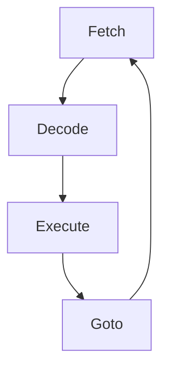

# Sistemi Operativi

## Cos'è un sistema operativo?

Non esiste una riposta effettiva a questa domanda, però si può provare a darne una almeno dal punto di vista tecnico.

I livelli sono **_HARDWARE_**, **_SO_** (precedentemente citati) e **_GUI_**.

L'HARDWARE opera in due modalità

1. user (GUI);
2. kernel (SO) .

La modalità viene determinata da un bit nel registro **_PSW_** (Program Status Word)

**_Il sistema operativo esegue in modalità kernel_**.
Ogni altro programma esegue in modalità **_user_**.

Esempio: Cambio di programma sul PC.
Assumendo che voglio passare dall'applicazione di Spotify a quella di Chrome, la sequenza delle azioni sarà la seguente.

1. Spotify in modalità user.
2. Il sistema operativo viene eseguito in modalità kernel.
3. Chrome viene avviato in modalità user.

Quando utilizzo un computer non interagisco con il SO, ma con la GUI.

- La GUI esegue in modalità user.
- Non fa parte del SO, anche se tutti i SO hanno una GUI.
- NON è indispensabile.
- Esistono dei programmi che girano in USER, ma comunque aiutano il SO.

> La GUI **_non è indispensabile_** percchè ogni programma potrebbe comunque essere eseguito ugualmente in _Shell/CMD_

---

## Cosa fa un sistema operativo?

- Consente la multiprogrammazione
- Realizza la memoria virtuale
- Realizza un ambiente multiutente

> Nella **_multiprogrammazione_** il processore viene utilizzato a turno dai diversi programmi.
>
> Con la **_Memoria Virtuale_** l'elaboratore viene illuso di avere una RAM che in realtà non ha.

Considerando una macchina fisica con un processore, una ram e senza fil esiste un "macchina virtuale" che ci gira sopra, questo viene creato dal sistema operativo (S.O.).
Questa macchina virtuale ha _n_ processori, una RAM _teoricamente_ infinita nella quale i file sono una realtà esistente.
Esso, fondamentalmente, svolge due compiti:

1. Gestisce i file;
2. Gestisce i processi (multiprogrammazione).

Il **Kernel level** e **User level** communicano tramite **_system call interface_**.

Esempio.
Per la riga di codice:

```java
system.out.println("ciao")
```

Non abbiamo Java che 'magicamente' scrive "ciao", bensì, per eseguire questa azione deve richiedere l'intervento del Sistema Operativo tramite **_system call interface_**.
Ovviamente per questo intervento il calcolatore passerà in modalità kernel.

---

## Storia dei sistemi operativi

Per comprendere al meglio come funzionano i sistemi operativi attuale, necessitiamo di conoscere i sistemi operativi degli anni '60.

### Sistema Batch

Le macchine venfono utilizzate per **calcoli scientifici**.
Il programma viene **_inciso_** su una scheda, che prende il nome di **_JOB_**.

> Job = processo degli anni '60.

Le istruzioni che utilizzano il sistema operativo vengono precedute dal simbolo **'$'**.

- **_$JOB_** = Inizio del processo;
- **_$FORTRAN_** per compilare il codice;
  > ovviamente si usa questo comando se il linguaggio viene scritto in FORTRAN, un po' come quando utilizziamo il comando javac, per
  > compilare java.
- **_$LOAD_** per caricare l'eseguibile in RAM;
- **_$RUN_** per eseguire;
- **_$END_** fine del processo.

Tutti i programmi di quel periodo storico servivano per trasformare dei dati forniti in INPUT.
Nella END i dati venivano sempre forniti in OUTPUT.

Ovviamente ci sono macchine diverse:

- legge le schede che contengono i programmi e le mette in un nastro di input;
- Legge il nastro e usa il SO per eseguire i programmi, carica i dati sul nastro di output.
  > Questa macchina comprende il compilatore nel **_nastro di sistema_**
- Stampa il nastro output.

Il SO batch divide la ram in system area e user area.
La user area può **_eseguire solo un JOB alla volta_**, quello in esecuzione.
Quindi nella RAM sono sempre presenti:

- codice e dati del sistema operativo;
- codice e dati dell'unico JOB in esecuzione.

> Con il tempo la user area diventerà disponibile sempre a più programmi, non più uno solo.

**_Grazie ai batch i tempi di utilizzo della CPU vengono ridotti_**.

Ai tempi i processori erano veramente costosi, non ci si poteva permettere di non utilizzarli.
Con questo sistema a tre macchine si mettevano sul nastro di lettura 10/20 programmi, facendo in modo che il processore non si fermasse mai, eseguendo 20 processi uno dopo l'altro.
I sistemi di batch quindi consentono un utilizzo **_efficiente della CPU_** a discapito del servizio dell'utente.

Le funzioni del sistema di batch sono:

- scheduling banale, processi eseguiti nell'ordine in cui viene letto il nastro
- gestione memoria banale
  - una parte al SO
  - una parte al JOB
- Protezione, anche se due JOB non possono coesistere in memoria, è necessaria la protezione perchè:
  - un job non può utilizzare la locazione di memoria destinata ad un altro job
  - un job non può accedere alla system area, quindi non può accedere a locazioni di memoria destinate al sistema.

---

### Terza generazione, Circuiti integrati

Nascono gli editor, le macchine vengono utilizzate per calcoli scientifici che richiedono parecchia CPU.
Ci sono le interfacce, consentito l'utilizzo della tastiera.
**_Il sistema operativo può eseguire programmazione_**, prende il nome di kernel.

Ora la memoria viene partizionata, più job vengono caricati in memoria.

- System Area
  - kernel
- User Area
  - JOB 1
  - JOB fino a n
  - Free memory

Se JOB 1 richiede la memoria di un registro (lenta), il sistema operativo si occupa di questa lettura **_mentre_** il processore si occupa del JOB 2.
**_L'hardware deve quindi consentire a CPU e dispositivi di lavorare in parallelo_**.
Il periodo di I/O è un tempo 'morto', per questo in quel momento viene consentita l'esecuzione del JOB 2.
Questo diventa possibile perchè ci sono più job caricati in memoria.
Quando l'operazione di I/O viene conclusa, il JOB torna a quellu schedulabili, questo significa che prima o poi il processore verrà nuovamente utilizzato da lui.

Da sottolineare la differenza tra:

- **_CPU BOUND_**
  > sono dei programmi che fanno dei calcoli, utilizzo alto di CPU e basso di I/O.
- **_I/O BOUND_**
  > sono dei programmi che utilizzano dati, utilizzo alto di I/O e basso di CPU.

L'operazione in cui il sistema operativo scheglie a chi dare la CPU tra chi la richiede, si chiama scheduling.

**_IMPORTANTE_**  
Nessun programma deve uscire dalla memoria che gli è stata dedicata.
Job 2 deve utilizzare solo i registri di memoria che si trovano nella sua parte di RAM.

Il processore contiene due registri (_lower e upper bound_) che contengono i due registri estremi di un determinato processo.
Il confronto degli indirizzi di memoria viene eseguito da un modulo hardware che controlla se il registro con il quale si vuole interagire è compreso tra upper e lower bound.
Se non viene trovata nessuna corrispondenza questo viene communicato all'hardware.
Il segnale di interruzione arriva al processore, bloccando la sua esecuzione.
In pratica il processore viene stroatto al jobn ed entra in gioco il SO.

Vi sono due modalità di gestione:

- partitioning (statico) a tutti la stessa memoria.
- pooling (dinamico) a seconda di quanta memoria richiede un job viene separata.

Ovviamente il pooling **_è più efficace_** si evita di avere troppi registri non usati e non si rischia di non avere abbastanza spazio per un job.

**_Il rapporto tra programmi eseguiti e spazio utilizzato si chiama throughput_**.  
Per massimizzarlo bisogna creare le condizioni affinchè tutti i programmi vadano in parallelo.
Lo scheduler di conseguenza deve privileggiare i programmi che fanno uno di I/O, in modo da spostarsi da un JOB ad un altro ogni volta che viene rischiesta una interazione di lettura/scrittura.

**_Con i sistemi multiprogrammati vengono introdotti due concetti:_**  

1. _program priority_, ad ogni programma viene assegnata una priorità;
2. _preemption_, il processore viene tolto forzatatamente al processo che lo stava utilizzando;
    1. Se è in esecuzione un programma di CPU BOUND e un processo di I/O BOUND ha finito la sua operazione di input/outout allora il processore tornerà forzatamente a questo
    2. **_Viene fatto per migliorare il throughput_**

In questo periodo storico nascono gli **_hard disk_**, quindi non vi è più la necessità di utilizzare i natsri di lettura.
Questo concede alla multiprogrammazione di arricchirsi con lo **_spooling_**.
I programmi quindi sono caricati in memoria, nel momento in cui un job termina, il suo contenuto **viene spostato** nell'hard disk e sulla RAM viene caricato un nuovo programma.

Nasce il concetto di avere più terminali collegati allo stesso calcolatore.
Diventa estremamente importante dare ad ogni soggetto che utilizza un terminale l'idea di star interagendo continuamente con il calcolatore.
Nasce di conseguenza il concetto di **time-sharing**, ogni tot tempo il processore passa da  un terminale ad un altro.

**Multiprogrammazione:** priorità, preemption throughput.

**Time Sharing:** Round robin, time slice, tempi di risposta.

**_IMPORTANTE_**  
Quando lo scheduled è _in funzione_, quindi quando sta passando da un processo ad un altro o da un terminale ad un altro, utilizza il processore togliendo tempo all'esecuzione.
Si parla, in questo caso, di **overhead**.

Quindi ad esempio avere un context switch frequente garantisce maggiore interattività ma ovviamente danneggia il throughput.

---

### Quarta generazione, Circuiti Integrati

A partire dagli anni '80 si diffondono i PC.  
I computer diventano quindi personali (Personal Computer) quindi bisogna renderne più facile l'utilizzo.  
Per questo vengono introdotte le **GUI**.  

#### Richiami di architettura e system call

Il SO interagisce direttamente con l'hardware.  
Il progettista del SO deve conoscere l'hardaware su cui gira il SO.

**_CPU_**

Preleva delle istruzioni dalla memoria, le decodifica e le esegue, il suo tradizionale ciclo:



Il processore possiede registri generali e registri di controllo.

- **_Registri Generali_** = utilizzati dalla ALU (primo livello della gerarchia di memoria)
- **_Registri di Controllo_** = servono per far funzionare la CPU

I principali registri della CPU sono:

- **_Program Counter_** (PC): Indirizzo dell'istruzione da prelevare
- **_Stack Pointer_** (SP): Puntatore al top dello stack, contenente i frame delle procedure già iniziate, ma non ancora terminate
- **_Program Status Word_** (PSW):
  - **_Privileged Mode_** (PM): bit di modalità user/kernel
  - **_Condition Mode_** (CC): codici di condizione impostati da istruzioni di confronto/codici di proprietà di operazioni aritmetiche
  - **_Interruct Mask_** (IM): bit usati per gestire interrupt
  - **_Interrupt Code_** (IC): bit usati per gestire interrupt
- **_Memory Protection Information_** (MPI): informazioni sulla porzione di memoria accessibile.  

I primi due registri contengono indirizzi di memoria.  
I registri di Upper e Lower Bound sono parte del **PSW**.  

Le istruzioni privilegiate sono quelle che permettono di nodificare i valori del registro PSW.  
Quest'ultime sono eseguibili solo in modalità kernel.  
Ovviamente i programmi non possono modificare parametri necessari al funzionamento del processore.

#### Interruzioni

Il SO entra in gioco in due maniere:

- quando viene chiamato dal programma
- quando un programma sta svolgendo un'azione non contemplata e di conseguenza va fermato;

**L'interruzione è un meccanismo che informa il processore dell'accadimento di qualcosa che deve essere trattato.**  
L'obbiettivo dell'interruzione è duplice:

1. si ferma il normale ciclo di intervento della CPU, interrompere l'esecuzione del programma
2. richiedo intervento del SO

**Come si manifesta l'INTERRUPT?**  
Viene eseguito da un segnale hardware, sulla linea del BUS.  
Il segnale può essere inviato dal programma in esecuzione oppure dal clock/controller di un dispositivo.

**Interruzioni HARDWARE**  
Si tratta di eventi asincroni rispetto al programma in esecuzione.  

- interruzioni I/O (utilizzate per notificare qualcosa al processore)
- interruzioni timer (segnale inviato dal clock quando il tempo messo a disposizione al programma termina)

**Nel momento in cui un job termina la sua operazione I/O necessita del processore.**
**La fine del I/O del job causa una interruzione, questa permette di far fronte al job tra quelli schedulabili.**

Nel momento in cui si verifica una interrupt **il processore** non esegue più come istruzione successiva quella localizzata nel PC ma va ad eseguire la prima del interrupt handler.  
Quando il sistema operativo ha svolto il suo compito allora il programma che era in esecuzione prima potrà ripartire dall’istruzione che si trova nel pc.  
**Nell’interrupt handler si trova che cosa bisogna fare per gestire l’interruzione.**  

Può capitare che mentre è in esecuzione l’interrupt handler si verifichi un’altra interrupt;  

succede la stessa identica cosa:
Nel caso di salto tra i due handlers non c’è il passaggio da user a kernel dato che siamo già in modalità kernel.
Quando si torna ai programmi in modalità user sarà lo scheduler a decidere se quando si è verificata la interrupt era in esecuzione word non è detto che ricomincerà l’esecuzione di word.  

**Gestione interrupt a cascata.**

Gli interrupt vengono organizzati in classi di priorità

- quando si gestisce una certa richiesta di interrupt, tutte quelle della stessa classe o di classi inferiori vengono ignorate. Tali richieste (quelle ignorate) rimangono pendenti.
  
**In che modo vengono ignorati gli interrupt con priorità minore?**  
Tramite l'**IM** (interrupt mask).  
Questa sequenza di bit dice quali interruzioni sono trattabili (enabled) e quali invece non lo sono (Masked Off).  
Quando il programma gira in modalità user tutti gli interrupt sono abilitati, inoltre il programma non può cambiare i valori del PSW, quindi di conseguenza nemmeno quelli del IM.

Per ogni **classe di interrupt** si trova un **interrupt vector**, situato nella locazione di memoria riservata al SO.  
Il vettore contiene l'indirizzo alla prima istruzione della interruzione relativa.  
Ovviamente quando questo indirizzo viene caricato sul PC, allora la prossima istruzione eseguita sarà proprio quella.  
Sempre nell'interrupt handler **sono contenuti** i valori che devono prendere i registri della PSW.  

Per ogni classe di interrupt si ha una **SRIA** che serve a memorizzare i valori seguenti nei registri:

- PC
- SP
- PSW

**Cosa succede quando arriva una interruzione abilitata?**

Viene inviato un segnale via hardware.  
Questo segnale importa l'**IC** della **PSW** che serve a comunicare al SO, le cause dell'interruzione.  
I valori dei registri dei PC, SP, PSW relativi al programma P vengono salvati nella **SRIA**.
> Vengono slavati i valori che avevano i vari registri, così una volta terminata l'interrupt si torna alla normale esecuzione

I registri PC e PSW vengono quindi impostati in base a ciò che veniva trasmesso deel relativo interrupt vector.  
L'interrupt handler può quindi far ripartire.


